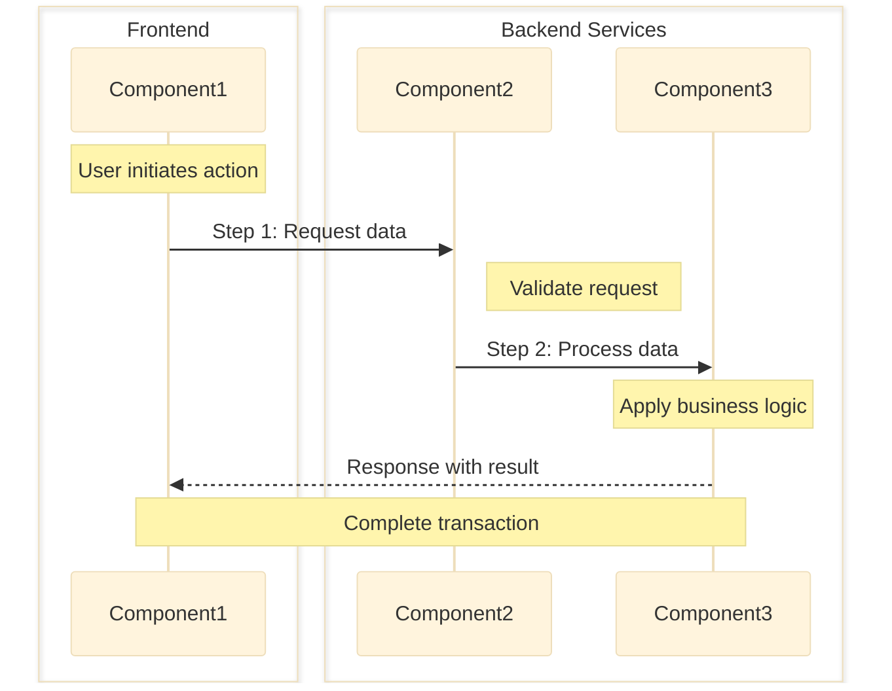
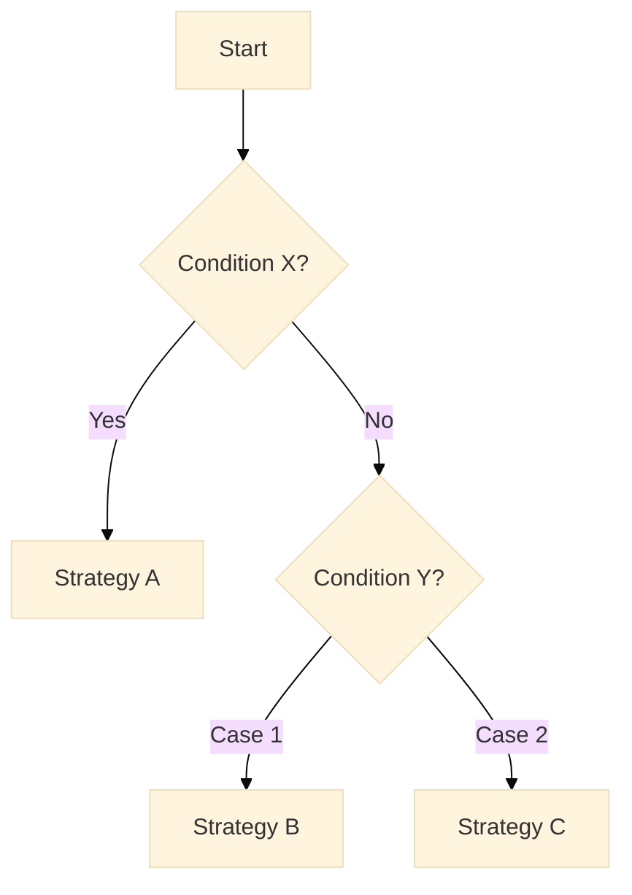

<!--
Prompt to trigger the action:

First, read @docs/architecture/_templates/research.md to understand the research methodology and requirements.
Then ask me one question at a time to gather requirements for the research. Once you have enough information, conduct the research following the template's instructions and save
the document under @docs/architecture/researches/

Use the maximum amount of ultrathink. Take all the time you need. It's much better if you do too much
research and thinking than not enough.
-->

<!--
LLM Instructions for Creating Research Document from This Template:

1. FILE CREATION
    - Create new file at: `docs/architecture/researches/{YYYY-MM-DD}-{topic-slug}.md`
    - Format: YYYY-MM-DD = (date +%Y-%m-%d), topic-slug = lowercase-hyphenated-topic
    - Example: `docs/architecture/researches/2024-12-01-ipc-type-safety.md`
    - Record template version: Use `git log -1 --format=%H docs/architecture/_templates/research.md` to get last commit hash of this template
    - Fill in `template_version` field with commit hash or tag version

2. TEMPLATE USAGE
    - Copy entire template content EXCEPT this instruction block
    - Replace all placeholder values marked with {braces}
    - Complete all sections with thorough research findings
    - Remove any unused optional sections

3. SECTION RESPONSIBILITIES
    Technology Assessment (Library/Solution Level):
    - Detailed analysis of individual technologies (libraries, frameworks, services)
    - Basic implementation examples (Hello World level)
    - Objective pros/cons documentation
    - Community and package metrics

    Technology Comparative Analysis (Library/Solution Level):
    - Cross-sectional comparison across all evaluation dimensions
    - Systematic comparison beyond just features
    - Technical fit, performance, maintainability metrics
    - Bundle size and quantitative comparisons

    Implementation Strategies (Implementation Level):
    - Concrete implementation approaches using selected technologies
    - Multiple production-ready strategies with data flow diagrams
    - Detailed code examples with error handling
    - When to use/avoid scenarios

    Implementation Strategy Selection Guide (Implementation Level):
    - Guidance for choosing appropriate implementation strategies
    - Requirements-based strategy selection flowchart
    - Conditional branching (scale, performance requirements)
    - Clear decision paths to recommended strategies

4. RESEARCH METHODOLOGY
    Step 0: Exclusion Check
    - Verify none of the options are deprecated or unmaintained
    - Check against excluded libraries list below
    - Document why certain libraries were excluded from evaluation

    Step 1: Information Gathering
    - Serena MCP: Understand current codebase and existing technologies
      - Read @CLAUDE.md for project-specific guidelines and tech stack
      - Use `get_symbols_overview` to analyze file structures
      - Use `find_symbol` to understand implementation patterns
      - Use `search_for_pattern` to find usage examples
      - Review memory files for project context
    - Context7 MCP: Get latest library documentation (e.g., `/react-query`, `/zustand`)
    - DeepWiki MCP: Analyze repository structure (e.g., `tanstack/query`)
    - WebSearch: Find current best practices and tutorials
    - npm view: Collect package metadata and statistics
    - GitHub: Review issues for known problems and solutions

    Step 2: Option Evaluation (minimum 3 alternatives)
    Apply these criteria consistently with weights:
    - Technical Fit (30%): Problem-solution alignment
    - Performance (25%): Bundle size, runtime metrics
    - Developer Experience (20%): Learning curve, API design
    - Maintenance (15%): Community health, update frequency
    - Security (10%): Vulnerability track record

    Step 3: Documentation
    - Record all sources in Appendix section
    - Include exact commands and queries used
    - Note information gaps or limitations
    - Use recent information (verify publication dates)

5. CONTENT GUIDELINES
    Required Elements:
    - Title: Clear, descriptive research topic
    - Status: In Progress | Completed | Archived
    - Template Version: Git commit hash or tag from template repository
    - Template Source: Path to source template file
    - Executive Summary: 2-3 sentences, neutral findings only
    - Technology Comparative Analysis: Systematic evaluation table
    - Code Examples: Working implementations with error handling

    Writing Style:
    - Language: English only
    - References: @ for internal, URLs for external
    - Code: Proper syntax highlighting
    - Libraries: Always in backticks
    - Lists: Prefer bullets over tables for readability

    Diagram Guidelines:
    - Include mermaid diagrams where helpful
    - For sequenceDiagram: Use "Note" syntax to add explanatory context (e.g., Note over, Note right of)
    - For sequenceDiagram: Use "box" syntax to group related components logically
    - Make diagrams self-explanatory with descriptive labels and notes

6. IMPORTANT RULES
    - NO recommendations or "best choice" statements
    - NO subjective opinions or preferences
    - NO bias toward any option
    - Present facts and analysis only
    - Let humans make the decisions
    - NEVER evaluate deprecated or unmaintained libraries
    - Document all excluded options with clear reasons

7. QUALITY CHECKLIST
    Before submitting:
    □ At least 3 options evaluated
    □ All evaluation criteria applied consistently
    □ Code examples tested and complete
    □ All sources documented in Appendix
    □ Neutral tone maintained throughout
    □ No prescriptive statements included
-->

---

title: {Research topic or question}
status: {In Progress | Completed | Archived}
updated: {YYYY-MM-DD}
template_version: {commit hash}
template_source: docs/architecture/\_templates/research.md

---

## Executive Summary

{2-3 sentence overview of the research findings and key insights}

**Target Audience**: Technical decision makers evaluating options

## Prerequisites

### Required Knowledge

To fully understand the research findings and options presented in this document:

- **{Category Name}**
  - {Item Name}: {Brief description}
    - Reference: [{Document Title}]({URL})
      ...
      ...

## Problem Statement

### Context

{Describe the technical challenge or requirement that prompted this research}

### Requirements

- {Specific requirement or constraint}
- {Performance/scalability needs}
- {Compatibility requirements}
- {Security considerations}
- ...

## Excluded Technologies

### Libraries Not Considered

The following libraries were excluded from evaluation due to critical issues:

**{Library Name}**

- **Reason**: {Deprecated | No longer maintained | Security vulnerabilities | Incompatible with requirements}
- **Last Update**: {Date of last release or commit}
- **Known Issues**: {Critical problems that led to exclusion}
- **Alternative**: {Suggested alternative library if applicable}

{Repeat for each excluded library...}

_Note: Libraries may be excluded for being deprecated, having unaddressed security vulnerabilities, lack of maintenance (>2 years without updates), or fundamental incompatibility with project requirements._

## Technology Assessment

### Option {N}: {Technology/Library/Framework Name}

**Overview**
{Brief description of the solution}

**Key Features**

- {Feature 1}
- {Feature 2}
- {Feature 3}

**Implementation Example**

```typescript
// Example code showing typical usage
{code example}
```

**Pros**

- {Advantage 1}
- {Advantage 2}
- {Advantage 3}

**Cons**

- {Disadvantage 1}
- {Disadvantage 2}

**Metrics**

- **Community**: Stars: {number}, Contributors: {number}, Last Commit: {date}
- **Package**: Downloads: {number}, Version: {version}
- **Documentation**: {Complete/Partial/Minimal}

{Repeat for each additional options...}

## Technology Comparative Analysis

| Criteria          | Option 1                  | Option 2                  | Option 3                  |
| ----------------- | ------------------------- | ------------------------- | ------------------------- |
| Technical Fit     | {score/rating}            | {score/rating}            | {score/rating}            |
| Performance       | {metric}                  | {metric}                  | {metric}                  |
| Learning Curve    | {Low/Medium/High}         | {Low/Medium/High}         | {Low/Medium/High}         |
| Community Support | {Active/Moderate/Limited} | {Active/Moderate/Limited} | {Active/Moderate/Limited} |
| Documentation     | {Excellent/Good/Poor}     | {Excellent/Good/Poor}     | {Excellent/Good/Poor}     |
| Type Safety       | {Full/Partial/None}       | {Full/Partial/None}       | {Full/Partial/None}       |
| Bundle Size       | {size}                    | {size}                    | {size}                    |
| Maintenance Risk  | {Low/Medium/High}         | {Low/Medium/High}         | {Low/Medium/High}         |

## Implementation Strategies

### Strategy {N}: {Strategy Name}

#### Data Flow



#### Implementation

```typescript
// Detailed implementation example
{code showing the strategy}
```

**When to use**:

- {Scenario 1}
- ...

**When not to use**:

- {Scenario 1}
- ...

**Best Practices**:

- {Best practice 1}
- ...

{Repeat for each additional strategy...}

## Implementation Strategy Selection Guide



## Analysis Summary

### Evaluation Results

{Summarize the key findings from the technology comparative analysis and technology assessment without making recommendations}

### Key Considerations for Decision Making

- **Performance Requirements**: {How each option addresses performance needs}
- **Development Experience**: {Impact on developer productivity and learning curve}
- **Maintenance Burden**: {Long-term maintenance implications of each option}
- **Community Support**: {Availability of resources and community health}
- **Security Implications**: {Security considerations for each option}

### Trade-offs Analysis

For each option, analyze the gains and costs:

- **Option {N}: {Option Name}**
  - Gains: {What benefits this option provides}
  - Costs: {What drawbacks or sacrifices this option requires}

{Repeat for each additional option...}

### Risk Assessment

| Option   | Risk Level        | Primary Risks | Mitigation Strategies |
| -------- | ----------------- | ------------- | --------------------- |
| Option 1 | {Low/Medium/High} | {Main risks}  | {How to mitigate}     |
| Option 2 | {Low/Medium/High} | {Main risks}  | {How to mitigate}     |
| Option 3 | {Low/Medium/High} | {Main risks}  | {How to mitigate}     |

### Scenario-Based Analysis

- **If performance is critical**: {Which options are suitable and why}
- **If rapid development is priority**: {Which options are suitable and why}
- **If long-term maintenance is key**: {Which options are suitable and why}
- **If type safety is essential**: {Which options are suitable and why}
- **If bundle size must be minimal**: {Which options are suitable and why}

## References

- {List relevant documentation and resources}
  ...

## Appendix

### Information Sources Consulted

- **Context7 MCP**: {Libraries and versions examined - e.g., `/react-query v5`, `/zustand v4.5`}
- **DeepWiki MCP**: {Repositories analyzed - e.g., `tanstack/query`, `pmndrs/zustand`}
- **WebSearch**: {Key search queries and findings}
- **npm view**: {Package metadata commands used}
- **GitHub Analysis**: {Issues, PRs, and discussions reviewed}

### Search Queries Used

```
{Search Query Used}
...
```

### Commands Used

```bash
{npm view commands, git commands, etc.}
...
```

### Limitations

- {Any gaps in available information}
- {Areas requiring further investigation}
