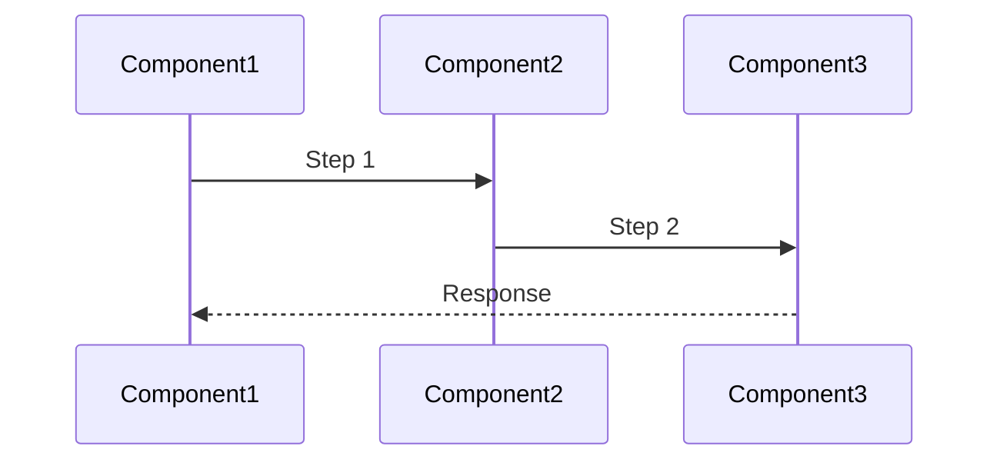
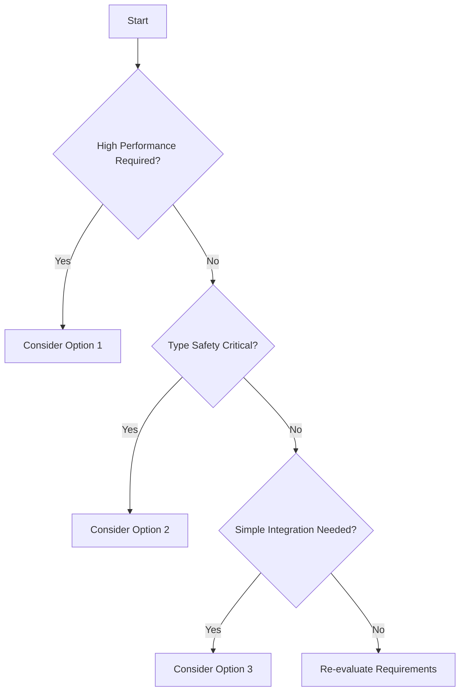

<!--
LLM Instructions for Creating Research Document from This Template:

1. FILE CREATION:
   - Create new file at: `docs/architecture/rfc/{YYYY-MM-DD}-{topic-slug}.md`
   - Format: YYYY-MM-DD = (date +%Y-%m-%d), topic-slug = lowercase-hyphenated-topic
   - Example: `docs/architecture/rfc/2024-12-01-ipc-type-safety.md`

2. TEMPLATE USAGE:
   - Copy entire template content EXCEPT this instruction block
   - Replace all placeholder values marked with {braces}
   - Complete all sections with thorough research findings
   - Remove any unused optional sections

3. RESEARCH PROCESS:
   - Use multiple information sources (WebSearch, Context7, DeepWiki)
   - Compare at least 3 alternatives when possible
   - Include recent information (check publication dates)
   - Provide code examples for each pattern
   - Create comparison matrices for systematic evaluation

4. CONTENT GUIDELINES:
   - Title: Clear description of the research topic
   - Status: Must be one of: In Progress, Completed, Archived
   - Executive Summary: 2-3 sentence overview of findings
   - Problem Statement: Clear definition of the technical challenge
   - Evaluation: Use consistent criteria across all options
   - Include both pros and cons for each option
   - Provide actionable recommendations

5. LANGUAGE & FORMATTING:
   - Write ALL content in English
   - Use "@" notation for internal repository references
   - Use standard URLs for external references
   - Include mermaid diagrams where helpful
   - Format code examples with proper syntax highlighting
   - Wrap all npm library names in backticks
   - Prefer bullet lists over tables for better readability

6. IMPORTANT:
   - Remove this entire instruction comment block from the new file
   - Ensure all research is current (check dates)
   - Include version numbers for libraries/frameworks
   - Document search queries used for transparency
   - Save work frequently if research is extensive
-->

---

title: {Research topic or question}
status: {In Progress | Completed | Archived}
updated: {YYYY-MM-DD}

---

## Executive Summary

{2-3 sentence overview of the research findings and recommended approach}

**Target Audience**: {Specify who will use this research - e.g., Electron developers, AI agents, DevOps teams}

## Prerequisites

### Required Knowledge

To fully understand and implement the recommendations in this document:

- **Core Technologies**:
  - {Technology 1}: {Brief description}
  - {Technology 2}: {Brief description}
- **Programming Languages**:
  - TypeScript: {Required proficiency level}
  - {Other language if applicable}

- **Frameworks & Tools**:
  - {Framework/Tool}: {Purpose and required knowledge level}

## Problem Statement

### Context

{Describe the technical challenge or requirement that prompted this research}

### Requirements

- {Specific requirement or constraint}
- {Performance/scalability needs}
- {Compatibility requirements}
- {Security considerations}

### Success Criteria

- {Measurable outcome}
- {Evaluation metric}

## Research Methodology

### Information Sources

- **Web Search**: {List search queries used}
- **Documentation Review**: {Official docs, GitHub repos examined with tools like context7}
- **Community Insights**: {Forums, discussions, issues reviewed}
- **Code Analysis**: {Repositories analyzed with tools like DeepWiki}

### Evaluation Criteria

1. **Technical Fit**: {How well it solves the problem}
2. **Performance**: {Speed, efficiency, resource usage}
3. **Developer Experience**: {Ease of use, learning curve}
4. **Maintenance**: {Long-term viability, community support}
5. **Security**: {Security considerations and track record}

## Options Analysis

### Option 1: {Library/Pattern/Solution Name}

**Overview**
{Brief description of the solution}

**Key Features**

- {Feature 1}
- {Feature 2}
- {Feature 3}

**Implementation Example**

```typescript
// Example code showing typical usage
{code example}
```

**Pros**

- {Advantage 1}
- {Advantage 2}
- {Advantage 3}

**Cons**

- {Disadvantage 1}
- {Disadvantage 2}

**Metrics**

- **NPM Weekly Downloads**: {number}
- **GitHub Stars**: {number}
- **Last Updated**: {date}
- **TypeScript Support**: {Yes/No/Partial}

### Option 2: {Library/Pattern/Solution Name}

{Repeat same structure as Option 1}

### Option 3: {Library/Pattern/Solution Name}

{Repeat same structure as Option 1}

## Comparison Matrix

| Criteria          | Option 1                  | Option 2                  | Option 3                  |
| ----------------- | ------------------------- | ------------------------- | ------------------------- |
| Technical Fit     | {score/rating}            | {score/rating}            | {score/rating}            |
| Performance       | {metric}                  | {metric}                  | {metric}                  |
| Learning Curve    | {Low/Medium/High}         | {Low/Medium/High}         | {Low/Medium/High}         |
| Community Support | {Active/Moderate/Limited} | {Active/Moderate/Limited} | {Active/Moderate/Limited} |
| Documentation     | {Excellent/Good/Poor}     | {Excellent/Good/Poor}     | {Excellent/Good/Poor}     |
| Type Safety       | {Full/Partial/None}       | {Full/Partial/None}       | {Full/Partial/None}       |
| Bundle Size       | {size}                    | {size}                    | {size}                    |
| Maintenance Risk  | {Low/Medium/High}         | {Low/Medium/High}         | {Low/Medium/High}         |

## Implementation Patterns

### Pattern A: {Pattern Name}

#### Data Flow



#### Implementation

```typescript
// Detailed implementation example
{code showing the pattern}
```

**When to use**:

- {Scenario 1}
- {Scenario 2}

**Best Practices**:

- {Best practice 1}
- {Best practice 2}
- Error handling: {How to handle errors}

### Pattern B: {Pattern Name}

#### Data Flow

{Similar structure as Pattern A}

#### Implementation

```typescript
// Detailed implementation example
{code showing the pattern}
```

**When to use**:

- {Scenario 1}
- {Scenario 2}

**Best Practices**:

- {Best practice 1}
- {Best practice 2}

## Decision Flow



## Recommendations

### Primary Recommendation

**{Recommended Option}**

{Explain why this is the recommended choice based on requirements and evaluation}

### Technologies to Use

**IMPORTANT: These are the ONLY technologies that should be used for this implementation**

#### Core Libraries

- **`{library-name}`**
  - npm package: `{exact-package-name}`
  - Version: {Specific version or range}
  - Installation: `pnpm add {package-name}`
  - Purpose: {Why this library}
  - Selection reason: {Why chosen over alternatives}

#### Supporting Libraries

- **`{library-1}`**
  - npm package: `{exact-package-name}`
  - Version: {version}
  - Purpose: {specific use case}
  - Selection reason: {why needed}

#### Development Tools

- **{Tool 1}**: {Purpose and configuration}
- **{Tool 2}**: {Purpose and configuration}

### Technologies NOT to Use

**CRITICAL: Do NOT use these technologies under any circumstances**

- **{Rejected Option 1}**
  - Reason: {Why it should not be used}
  - Common mistake: {How it might be accidentally introduced}
- **{Rejected Option 2}**
  - Reason: {Why it should not be used}
  - Alternative: Use {recommended technology} instead

- **{Similar but incompatible library}**
  - Reason: {Conflicts with chosen solution}
  - Note: {Any special considerations}

### Alternative Scenarios

- **If {specific condition}**: Consider {alternative option} because {reason}
- **If {specific condition}**: Consider {alternative option} because {reason}

## References

{List relevant documentation and resources}

Examples:

- Related RFC: @docs/architecture/adr/{YYYY-MM-DD}-{slug}.md
- https://example.com/relevant-article (external reference)

## Appendix

### Search Queries Used

```
{Query 1}
{Query 2}
{Query 3}
```

### Raw Performance Data

{Optional: Include benchmarks, test results, or other raw data}

### Additional Notes

{Any other relevant information not covered above}
