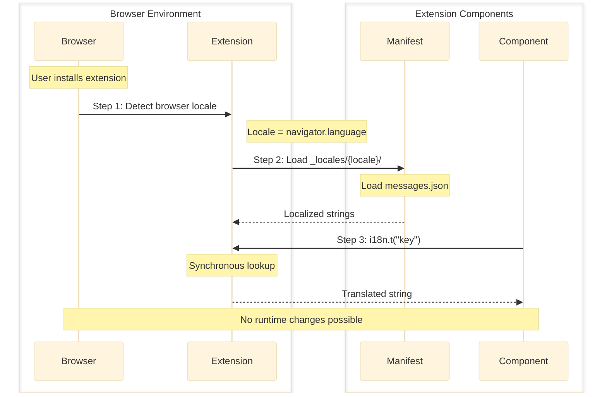
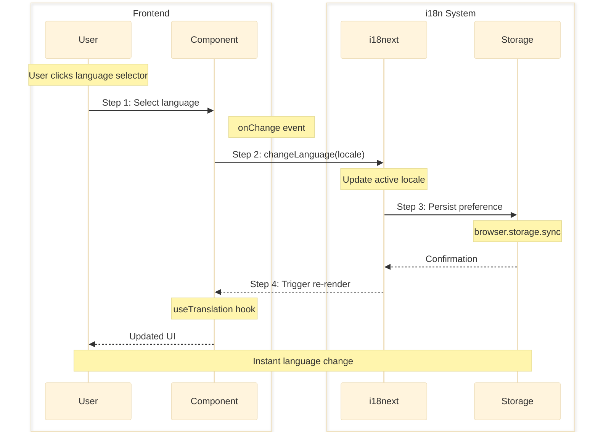
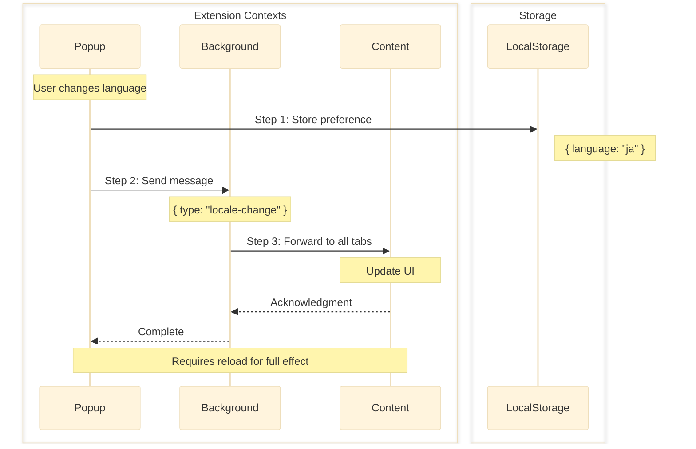
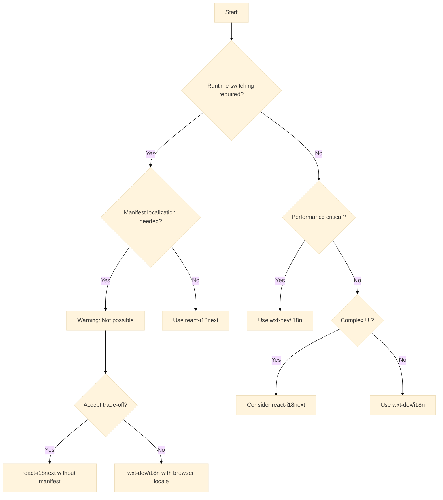

## Executive Summary

Analysis of internationalization approaches for WXT browser extensions reveals three primary options: `@wxt-dev/i18n` for native browser integration, `react-i18next` for runtime switching capability, and custom hybrid solutions. Each option presents distinct trade-offs between browser-native features, runtime flexibility, and implementation complexity.

**Target Audience**: Technical decision makers evaluating browser extension i18n options

## Prerequisites

### Required Knowledge

To fully understand the research findings and options presented in this document:

- **Browser Extension Development**
  - Browser Extension APIs: Understanding of manifest.json, content scripts, and background workers
    - Reference: [Chrome Extensions Docs](https://developer.chrome.com/docs/extensions)
  - Web Extensions i18n: Familiarity with browser.i18n.getMessage API
    - Reference: [browser.i18n API](https://developer.chrome.com/docs/extensions/reference/i18n/)

- **Frontend Technologies**
  - TypeScript: Intermediate proficiency with type systems
    - Reference: [TypeScript Handbook](https://www.typescriptlang.org/docs/)
  - React: Component composition and hooks
    - Reference: [React Documentation](https://react.dev/)

- **Framework Knowledge**
  - WXT Framework: Understanding of entrypoints and module system
    - Reference: [WXT Documentation](https://wxt.dev/)

## Problem Statement

### Context

Browser extensions requiring internationalization face unique architectural constraints due to the browser.i18n API design. The API loads translations at extension startup based on browser locale settings and does not support runtime locale changes. This creates a fundamental challenge when users expect in-app language switching capability.

### Requirements

- Type-safe internationalization for all UI components
- Support for English and Japanese locales
- Runtime language switching capability
- Consistent translation across popup, options, and content scripts
- Manifest.json localization support
- Minimal bundle size impact
- Security compliance (no runtime fetching of code)

## Technology Assessment

### Option 1: @wxt-dev/i18n

**Overview**
Type-safe wrapper around browser.i18n.getMessage with YAML/JSON support and VS Code integration, designed specifically for WXT framework extensions.

**Key Features**

- Type generation for translation keys
- Support for YAML, JSON, TOML formats
- Manifest.json and CSS localization
- Synchronous translation loading
- Plural form support via browser API
- VS Code IntelliSense integration

**Implementation Example**

```typescript
// wxt.config.ts
export default defineConfig({
  modules: ["@wxt-dev/i18n/module"],
  manifest: {
    default_locale: "en",
    name: "__MSG_extension_name__",
    description: "__MSG_extension_description__"
  }
});

// locales/en.yml
extension_name: My Extension
popup:
  title: Welcome
  count: "Count is $1"

// entrypoints/popup/App.tsx
import { i18n } from "#i18n";

function Popup() {
  const [count, setCount] = useState(0);

  return (
    <div>
      <h1>{i18n.t("popup.title")}</h1>
      <button>{i18n.t("popup.count", [count])}</button>
    </div>
  );
}
```

**Pros**

- Official WXT module with first-class framework support
- Zero runtime overhead (translations loaded at startup)
- Full type safety with auto-generated types
- Manifest and CSS localization support
- No JavaScript bundle bloat
- Follows browser extension standards

**Cons**

- No runtime locale switching capability
- Language determined by browser/OS settings only
- Limited plural form support for complex languages
- Requires extension reload for language change

**Metrics**

- **Community**: Stars: 4,400+ (WXT framework), Contributors: 50+, Last Commit: Active
- **Package**: Downloads: 1,841/week, Version: 1.x
- **Documentation**: Complete

### Option 2: react-i18next

**Overview**
Comprehensive i18n solution with React integration, supporting dynamic locale switching and advanced formatting features.

**Key Features**

- Runtime locale switching
- Lazy loading of translations
- Rich plural and formatting support
- React hooks and components
- Namespace organization
- Interpolation and nesting support

**Implementation Example**

```typescript
// lib/i18n.ts
import i18n from "i18next";
import { initReactI18next } from "react-i18next";
import enTranslations from "./locales/en.json";
import jaTranslations from "./locales/ja.json";

i18n
  .use(initReactI18next)
  .init({
    resources: {
      en: { translation: enTranslations },
      ja: { translation: jaTranslations }
    },
    lng: "en",
    fallbackLng: "en",
    interpolation: {
      escapeValue: false
    }
  });

// entrypoints/popup/App.tsx
import { useTranslation } from "react-i18next";

function Popup() {
  const { t, i18n } = useTranslation();

  return (
    <div>
      <h1>{t("welcome.title")}</h1>
      <select onChange={(e) => i18n.changeLanguage(e.target.value)}>
        <option value="en">English</option>
        <option value="ja">日本語</option>
      </select>
    </div>
  );
}
```

**Pros**

- Full runtime locale switching without reload
- Advanced i18n features (plurals, context, formatting)
- Large ecosystem with plugins and tools
- Extensive documentation and community support
- Works across all entrypoints consistently

**Cons**

- Cannot localize manifest.json or extension metadata
- Larger bundle size (~40KB gzipped)
- All translations bundled in JavaScript
- More complex initial setup
- Not designed for browser extensions specifically

**Metrics**

- **Community**: Stars: 7,800+, Contributors: 500+, Last Commit: Daily
- **Package**: Downloads: 3,352,038/week, Version: 15.x
- **Documentation**: Excellent

### Option 3: Custom Hybrid Solution

**Overview**
Attempting to combine @wxt-dev/i18n with custom runtime switching logic by fetching and applying translations dynamically.

**Key Features**

- Uses @wxt-dev/i18n as base
- Runtime fetching of messages.json files
- Storage-based locale persistence
- Message passing between contexts
- Custom translation application logic

**Implementation Example**

```typescript
// lib/i18n-custom.ts
import { i18n as baseI18n } from "#i18n";
import { browser } from "wxt/browser";

class I18nRuntime {
  private overrideLocale: string | null = null;
  private overrideMessages: Record<string, any> | null = null;

  async setLocale(locale: string): Promise<void> {
    this.overrideLocale = locale;
    await browser.storage.local.set({ language: locale });

    // Fetch messages at runtime
    const url = browser.runtime.getURL(`_locales/${locale}/messages.json`);
    const response = await fetch(url);
    this.overrideMessages = await response.json();

    // Notify all contexts
    await browser.runtime.sendMessage({
      type: "locale-changed",
      locale,
    });
  }

  t(key: string, ...args: any[]): string {
    if (this.overrideMessages) {
      const message = this.lookupMessage(key);
      return this.applySubstitutions(message, args);
    }
    return baseI18n.t(key, ...args);
  }

  private lookupMessage(key: string): string {
    // Custom message lookup logic
    const keys = key.split(".");
    let result = this.overrideMessages;
    for (const k of keys) {
      result = result?.[k];
    }
    return result?.message || key;
  }

  private applySubstitutions(message: string, args: any[]): string {
    // Apply $1, $2 substitutions
    return message.replace(/\$(\d+)/g, (_, index) => {
      return args[parseInt(index) - 1] || "";
    });
  }
}

export const i18n = new I18nRuntime();
```

**Pros**

- Attempts to provide runtime switching with type safety
- Maintains @wxt-dev/i18n type definitions
- Reuses existing translation files

**Cons**

- Violates browser extension security model
- Complex message passing and synchronization
- Runtime fetching impacts performance
- Requires page reload for complete update
- Error-prone substitution logic
- Not officially supported pattern
- Maintenance nightmare

**Metrics**

- **Community**: Stars: N/A, Contributors: N/A, Last Commit: N/A
- **Package**: Downloads: N/A, Version: N/A
- **Documentation**: None

## Technology Comparative Analysis

| Criteria          | @wxt-dev/i18n      | react-i18next      | Custom Hybrid         |
| ----------------- | ------------------ | ------------------ | --------------------- |
| Technical Fit     | Excellent (native) | Good (web-focused) | Poor (anti-pattern)   |
| Performance       | 0KB runtime        | ~40KB gzipped      | Variable (fetch cost) |
| Learning Curve    | Low                | Medium             | High                  |
| Community Support | Active             | Very Active        | None                  |
| Documentation     | Good               | Excellent          | None                  |
| Type Safety       | Full               | Full               | Partial               |
| Bundle Size       | Minimal            | 40KB+              | Minimal + runtime     |
| Maintenance Risk  | Low                | Low                | Very High             |

## Implementation Strategies

### Strategy 1: Browser-Native Approach

#### Data Flow



#### Implementation

```typescript
// wxt.config.ts
import { defineConfig } from "wxt";

export default defineConfig({
  modules: ["@wxt-dev/i18n/module"],
  manifest: {
    default_locale: "en",
    name: "__MSG_extension_name__",
    description: "__MSG_extension_description__"
  }
});

// locales/en.yml
extension_name: My Extension
extension_description: A helpful browser extension
popup:
  title: Welcome
  settings: Settings
  about: About

// locales/ja.yml
extension_name: 私の拡張機能
extension_description: 便利なブラウザ拡張機能
popup:
  title: ようこそ
  settings: 設定
  about: について

// entrypoints/popup/App.tsx
import { i18n } from "#i18n";

export function App() {
  return (
    <div>
      <h1>{i18n.t("popup.title")}</h1>
      <nav>
        <a href="/settings">{i18n.t("popup.settings")}</a>
        <a href="/about">{i18n.t("popup.about")}</a>
      </nav>
    </div>
  );
}
```

**When to use**:

- Building standard browser extensions
- Following browser platform conventions
- Manifest localization is required
- Performance is critical
- Users are comfortable with browser locale settings

**When not to use**:

- Runtime language switching is required
- Building SPA-like experiences
- User preferences need to override browser settings

**Best Practices**:

- Structure translations hierarchically for organization
- Use YAML for better readability during development
- Implement fallback keys for critical UI elements
- Test with multiple browser locales

### Strategy 2: React-Managed i18n

#### Data Flow



#### Implementation

```typescript
// lib/i18n.ts
import i18n from "i18next";
import { initReactI18next } from "react-i18next";
import { browser } from "wxt/browser";
import enTranslations from "./locales/en.json";
import jaTranslations from "./locales/ja.json";

// Initialize with stored preference
async function initI18n() {
  const stored = await browser.storage.sync.get("language");
  const defaultLang = stored.language || navigator.language.slice(0, 2);

  await i18n
    .use(initReactI18next)
    .init({
      resources: {
        en: { translation: enTranslations },
        ja: { translation: jaTranslations }
      },
      lng: defaultLang,
      fallbackLng: "en",
      interpolation: {
        escapeValue: false
      },
      react: {
        useSuspense: false
      }
    });

  // Persist language changes
  i18n.on("languageChanged", async (lng) => {
    await browser.storage.sync.set({ language: lng });
  });
}

// entrypoints/popup/main.tsx
import { StrictMode } from "react";
import { createRoot } from "react-dom/client";
import { initI18n } from "@/lib/i18n";
import App from "./App";

initI18n().then(() => {
  createRoot(document.getElementById("root")!).render(
    <StrictMode>
      <App />
    </StrictMode>
  );
});

// components/LanguageSelector.tsx
import { useTranslation } from "react-i18next";

export function LanguageSelector() {
  const { i18n } = useTranslation();

  return (
    <select
      value={i18n.language}
      onChange={(e) => i18n.changeLanguage(e.target.value)}
    >
      <option value="en">English</option>
      <option value="ja">日本語</option>
    </select>
  );
}
```

**When to use**:

- Runtime language switching is critical requirement
- Building complex UI with many components
- User preferences should override browser settings
- Consistent experience across all browsers

**When not to use**:

- Simple extensions with minimal UI
- Manifest localization is required
- Bundle size is critical concern

**Best Practices**:

- Initialize i18n before React render
- Persist user preference in browser.storage.sync
- Use namespaces for large translation sets
- Implement loading states during initialization
- Consider code-splitting for large language files

### Strategy 3: Hybrid with Message Passing

#### Data Flow



#### Implementation

```typescript
// lib/i18n-hybrid.ts
import { i18n as baseI18n } from "#i18n";
import { browser } from "wxt/browser";

class HybridI18n {
  private customLocale: string | null = null;
  private customMessages: Record<string, any> = {};

  async init() {
    // Load saved preference
    const { language } = await browser.storage.local.get("language");
    if (language && language !== browser.i18n.getUILanguage()) {
      await this.loadCustomLocale(language);
    }

    // Listen for changes
    browser.runtime.onMessage.addListener((message) => {
      if (message.type === "locale-changed") {
        this.loadCustomLocale(message.locale);
      }
    });
  }

  private async loadCustomLocale(locale: string) {
    this.customLocale = locale;
    const url = browser.runtime.getURL(`_locales/${locale}/messages.json`);

    try {
      const response = await fetch(url);
      const data = await response.json();
      this.customMessages = this.flattenMessages(data);
    } catch (error) {
      console.error("Failed to load locale:", error);
      this.customMessages = {};
    }
  }

  private flattenMessages(messages: any): Record<string, string> {
    const flat: Record<string, string> = {};
    for (const [key, value of Object.entries(messages)) {
      if (value && typeof value === "object" && "message" in value) {
        flat[key] = value.message;
      }
    }
    return flat;
  }

  t(key: string, ...args: any[]): string {
    if (this.customLocale && this.customMessages[key]) {
      return this.applySubstitutions(this.customMessages[key], args);
    }
    return baseI18n.t(key, ...args);
  }

  private applySubstitutions(message: string, args: any[]): string {
    return message.replace(/\$(\d+)/g, (_, index) => {
      return String(args[parseInt(index) - 1] || "");
    });
  }

  async setLocale(locale: string) {
    await browser.storage.local.set({ language: locale });
    await this.loadCustomLocale(locale);

    // Notify all contexts
    await browser.runtime.sendMessage({
      type: "locale-changed",
      locale
    });
  }
}

export const i18n = new HybridI18n();

// entrypoints/background.ts
import { defineBackground } from "wxt/sandbox";

export default defineBackground(() => {
  // Forward locale changes to all tabs
  browser.runtime.onMessage.addListener(async (message, sender) => {
    if (message.type === "locale-changed") {
      const tabs = await browser.tabs.query({});
      for (const tab of tabs) {
        if (tab.id && tab.id !== sender.tab?.id) {
          browser.tabs.sendMessage(tab.id, message);
        }
      }
    }
  });
});
```

**When to use**:

- Never recommended as primary approach
- Only if absolutely required to combine both approaches
- As temporary migration path

**When not to use**:

- New projects
- Production applications
- When maintainability is important

**Best Practices**:

- Avoid this pattern if possible
- Document the complexity thoroughly
- Plan migration to simpler approach
- Implement comprehensive error handling

## Implementation Strategy Selection Guide



## Analysis Summary

### Evaluation Results

The technology assessment reveals a fundamental architectural constraint in browser extensions: the browser.i18n API loads translations at startup based on browser locale and cannot be changed at runtime. This creates two distinct implementation paths with no perfect middle ground. Native solutions excel at browser integration but lack flexibility, while web-focused solutions provide flexibility but sacrifice native features.

### Key Considerations for Decision Making

- **Performance Requirements**: Native browser.i18n has zero runtime overhead, while react-i18next adds ~40KB to bundle size and requires JavaScript execution for every translation
- **Development Experience**: @wxt-dev/i18n provides superior type safety and IDE integration for WXT projects, while react-i18next offers familiar patterns for React developers
- **Maintenance Burden**: Both mainstream options have active maintenance and community support, while custom solutions create significant technical debt
- **Community Support**: react-i18next has broader ecosystem (3.3M weekly downloads) versus @wxt-dev/i18n's focused WXT community (1.8K weekly downloads)
- **Security Implications**: Native browser.i18n follows browser security model, react-i18next bundles translations in JavaScript, custom solutions may violate CSP

### Trade-offs Analysis

For each option, analyze the gains and costs:

- **Option 1: @wxt-dev/i18n**
  - Gains: Zero runtime cost, manifest localization, browser-native behavior, smallest bundle, type safety
  - Costs: No runtime switching, limited to browser locale, requires extension reload for changes

- **Option 2: react-i18next**
  - Gains: Full runtime switching, advanced i18n features, consistent behavior across browsers, familiar React patterns
  - Costs: 40KB bundle overhead, no manifest localization, all translations in JavaScript bundle

- **Option 3: Custom Hybrid**
  - Gains: Theoretical combination of both approaches
  - Costs: Complex implementation, maintenance burden, performance overhead, potential security issues, no community support

### Risk Assessment

| Option        | Risk Level | Primary Risks                                         | Mitigation Strategies                         |
| ------------- | ---------- | ----------------------------------------------------- | --------------------------------------------- |
| @wxt-dev/i18n | Low        | User confusion about language settings                | Clear documentation, link to browser settings |
| react-i18next | Low        | Bundle size growth, manifest not localized            | Code splitting, accept manifest limitation    |
| Custom Hybrid | High       | Breaking changes, security issues, maintenance burden | Avoid this approach, migrate if already used  |

### Scenario-Based Analysis

- **If performance is critical**: @wxt-dev/i18n provides zero runtime overhead and smallest bundle
- **If rapid development is priority**: react-i18next offers extensive documentation and familiar patterns
- **If long-term maintenance is key**: Both mainstream options have active communities; avoid custom solutions
- **If type safety is essential**: Both @wxt-dev/i18n and react-i18next provide full TypeScript support
- **If bundle size must be minimal**: @wxt-dev/i18n adds no runtime JavaScript for translations

## References

- WXT i18n Documentation: https://wxt.dev/guide/essentials/i18n
- @wxt-dev/i18n npm: https://www.npmjs.com/package/@wxt-dev/i18n
- react-i18next Documentation: https://react.i18next.com/
- Chrome i18n API Reference: https://developer.chrome.com/docs/extensions/reference/i18n/
- WXT GitHub Discussions: https://github.com/wxt-dev/wxt/discussions/930
- Related Decision: @docs/architecture/decisions/2025-08-10-use-react-i18next-for-runtime-locale-switching.md

## Appendix

### Information Sources Consulted

- **Context7 MCP**: `/react-i18next v15`, `/i18next v24`
- **DeepWiki MCP**: `wxt-dev/wxt`, `i18next/react-i18next`
- **WebSearch**: "WXT framework internationalization", "browser.i18n runtime switching", "react-i18next browser extension"
- **npm view**: `@wxt-dev/i18n`, `react-i18next`, `i18next`
- **GitHub Analysis**: wxt-dev/wxt issues #930, #327, #456

### Search Queries Used

```
"@wxt-dev/i18n" browser extension runtime locale switching
WXT framework i18n React TypeScript best practices
browser.i18n getMessage vs react-i18next performance
chrome extension manifest localization with react
```

### Commands Used

```bash
npm view @wxt-dev/i18n
npm view react-i18next
npm view i18next
```

### Limitations

- Browser.i18n API behavior varies slightly between Chrome and Firefox
- Performance metrics based on published bundle sizes, not real-world measurements
- Community metrics snapshot from current date, may change rapidly
