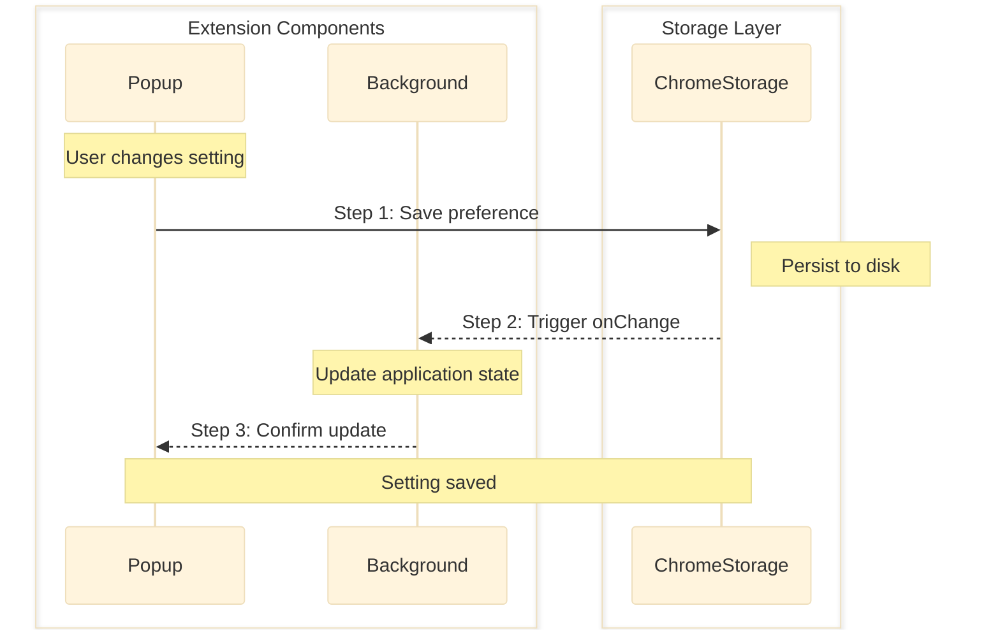
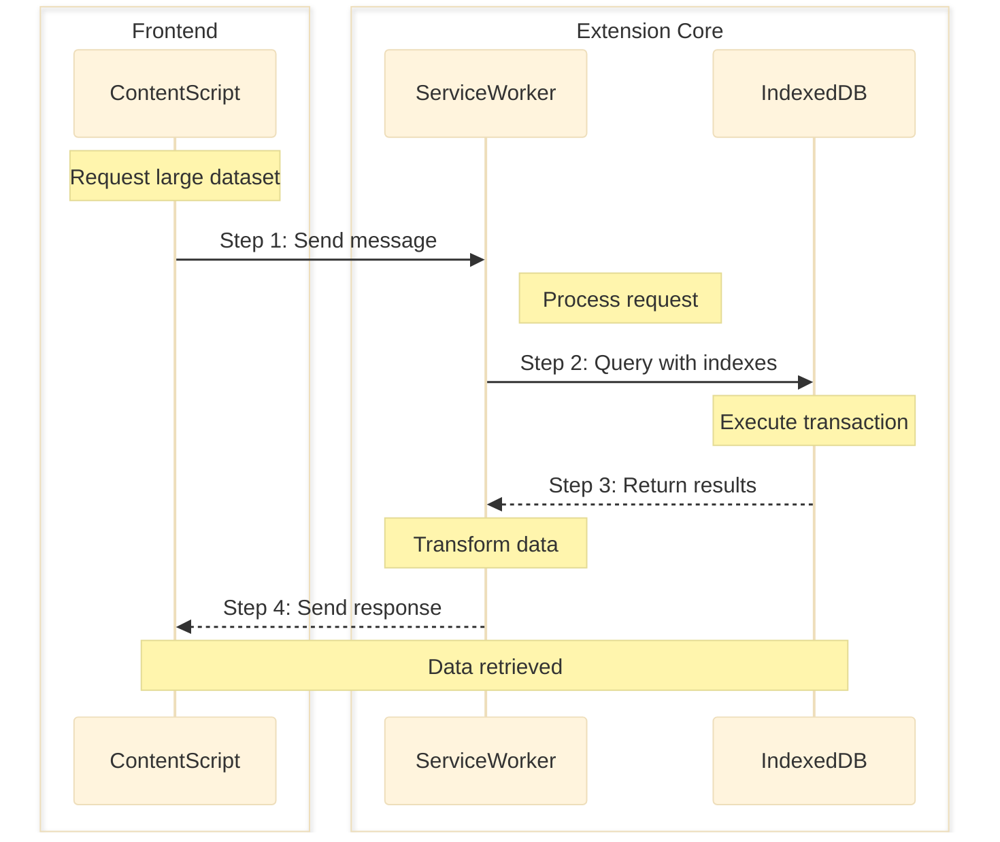
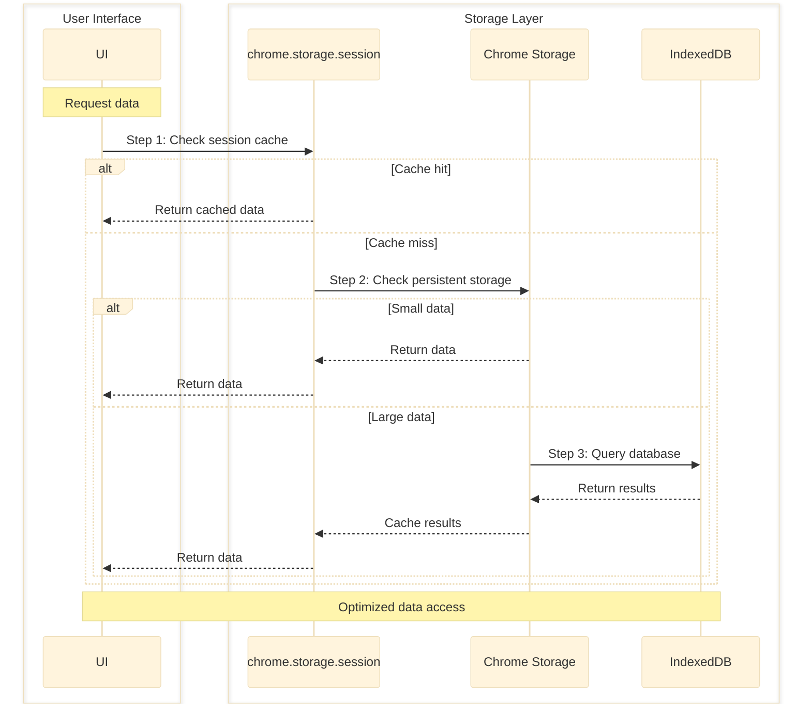
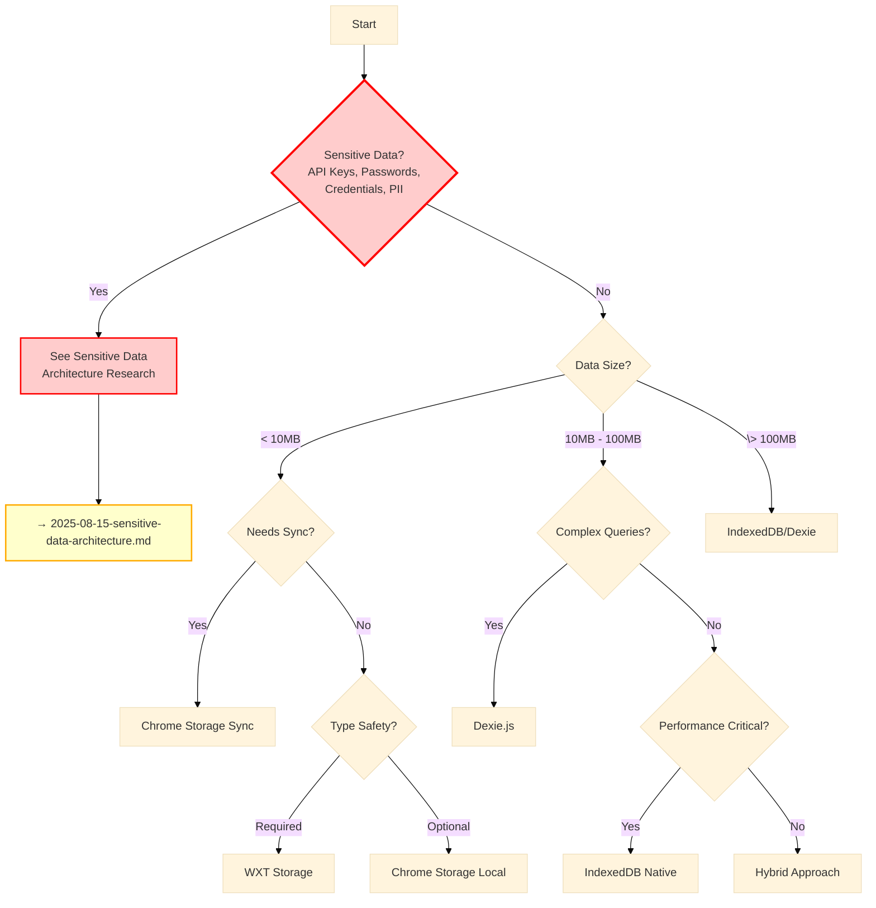

## Executive Summary

Comprehensive analysis of browser extension storage APIs reveals five primary storage solutions with distinct characteristics, alongside critical security architecture decisions for handling sensitive data. Chrome Storage API provides native extension support with sync capabilities, while WXT Storage API offers improved developer experience with TypeScript support, and IndexedDB handles large-scale data requirements with complex querying capabilities.

**Critical Finding**: For sensitive data (API keys, credentials, PII), a **remote-first architecture** is strongly recommended over local storage, with client-side encryption using Web Crypto API (AES-GCM) and zero-knowledge principles. Local storage should be limited to non-sensitive preferences and cached metadata.

**Target Audience**: Technical decision makers evaluating storage options and security architecture for browser extension development

## Prerequisites

**Important Note**: Service Workers cannot access localStorage or sessionStorage due to their synchronous nature conflicting with the async-only design of Service Workers. Use chrome.storage API or IndexedDB instead.

### Required Knowledge

To fully understand the research findings and options presented in this document:

- **Browser Extension Development**
  - Manifest V3 Architecture: Understanding of service workers and event-driven patterns
  - WebExtensions API: Familiarity with browser extension runtime and messaging
  - Content Script Isolation: Knowledge of execution contexts and boundaries
    - Reference: [Chrome Extensions Documentation](https://developer.chrome.com/docs/extensions/)

- **JavaScript/TypeScript**
  - Async/Await Patterns: Proficiency with asynchronous programming
  - Type Systems: Understanding of TypeScript generics and type inference
  - Promise-based APIs: Experience with modern JavaScript patterns
    - Reference: [TypeScript Handbook](https://www.typescriptlang.org/docs/)

- **Storage Concepts**
  - Key-Value Storage: Understanding of basic storage patterns
  - Transactional Databases: Knowledge of ACID properties and transactions
  - Data Serialization: JSON and structured cloning
    - Reference: [MDN Web Storage API](https://developer.mozilla.org/en-US/docs/Web/API/Storage_API)

## Problem Statement

### Context

Browser extensions require reliable data persistence solutions that work within the constraints of Manifest V3's service worker architecture, cross-browser compatibility requirements, and varying data scale requirements from simple preferences to complex datasets.

### Requirements

- Support for Manifest V3 service worker lifecycle
- Cross-browser compatibility (Chrome, Firefox, Edge, Safari)
- Data size scalability from kilobytes to gigabytes
- Type safety for TypeScript development
- Performance for both small frequent operations and bulk operations
- Security for sensitive data storage
- Synchronization capabilities across devices

## Excluded Technologies

### Libraries Not Considered

The following libraries were excluded from evaluation due to critical issues:

**localStorage/sessionStorage**

- **Reason**: Not available in service workers, fundamental incompatibility with Manifest V3
- **Last Update**: N/A (native API)
- **Known Issues**: Service worker context restriction, synchronous API blocking (Service Workers are designed to be fully async, conflicting with synchronous Web Storage APIs)
- **Alternative**: Chrome Storage API or IndexedDB
- **Note**: The Web Storage API (localStorage/sessionStorage) is synchronous and therefore not allowed in service workers

**WebSQL**

- **Reason**: Deprecated technology, removed from modern browsers
- **Last Update**: Deprecated since 2010
- **Known Issues**: No longer maintained, removed from Chrome 119+
- **Alternative**: IndexedDB for relational data needs

**Cookies**

- **Reason**: Not designed for extension data storage, security and partitioning concerns
- **Last Update**: N/A (different use case)
- **Known Issues**: Size limitations, security vulnerabilities, cross-origin restrictions
- **Alternative**: Chrome Storage API for extension-specific data

_Note: Libraries may be excluded for being deprecated, having unaddressed security vulnerabilities, lack of maintenance (>2 years without updates), or fundamental incompatibility with project requirements._

## Technology Assessment

### Option 1: Chrome Storage API (Native)

**Overview**
Native browser storage API designed specifically for extensions, offering multiple storage areas with different persistence and synchronization characteristics.

**Key Features**

- Four storage areas: local, sync, session, managed
- Accessible from all extension contexts
- Built-in change listeners for reactive updates
- No CORS restrictions
- JSON-compatible value serialization (arrays OK, Date/RegExp stringified, functions become {})

**Implementation Example**

```typescript
// Store data with type annotations
interface UserPreferences {
  theme: "light" | "dark";
  language: string;
}

await chrome.storage.local.set({
  preferences: { theme: "dark", language: "en" } as UserPreferences,
});

// Retrieve with manual type casting
const result = await chrome.storage.local.get(["preferences"]);
const prefs = result.preferences as UserPreferences;

// Listen for changes
chrome.storage.onChanged.addListener((changes, areaName) => {
  if (areaName === "local" && changes.preferences) {
    console.log("Preferences updated:", changes.preferences.newValue);
  }
});
```

**Pros**

- Zero dependencies, native browser support
- Designed specifically for extensions
- Multiple storage areas for different use cases
- Cross-device sync with chrome.storage.sync
- Works seamlessly with service workers

**Cons**

- Verbose API requiring boilerplate code
- No built-in type safety
- Limited to JSON-compatible types
- 10MB default limit for local storage (Chrome 114+; previously 5MB)
- chrome.storage.sync has quota limits: ~100KB total, 8KB per item, 512 items max
- No built-in encryption

**Metrics**

- **Community**: Native API (Chrome/Firefox/Edge support)
- **Package**: 0KB bundle size (native)
- **Documentation**: Excellent (official docs)

### Option 2: WXT Storage API

**Overview**
Modern wrapper around browser storage APIs providing type-safe, localStorage-like interface with built-in versioning and superior developer experience.

**Key Features**

- Type-safe API with TypeScript generics
- Storage area prefixes (local:, sync:, session:, managed:)
- Built-in data versioning and migrations
- Bulk operations optimization
- Reactive watchers with type inference

**Implementation Example**

```typescript
import { storage } from "wxt/storage";

// Define typed storage item with versioning
interface UserDataV2 {
  id: string;
  name: string;
  settings: { theme: string };
}

const userData = storage.defineItem<UserDataV2>("local:userData", {
  fallback: { id: "", name: "", settings: { theme: "light" } },
  version: 2,
  migrations: {
    2: (oldData: any) => ({
      ...oldData,
      settings: oldData.settings || { theme: "light" },
    }),
  },
});

// Type-safe operations
await userData.setValue({
  id: "123",
  name: "John",
  settings: { theme: "dark" },
});
const data = await userData.getValue(); // Fully typed

// Watch for changes
const unwatch = userData.watch((newData, oldData) => {
  console.log("Data changed:", newData);
});
```

**Pros**

- Excellent TypeScript support with full type inference
- Simple, intuitive API similar to localStorage
- Built-in versioning and migration support
- Auto-imports in WXT projects
- Comprehensive documentation

**Cons**

- Requires WXT framework or separate installation
- Additional dependency (~38.2KB unpacked)
- Still limited by underlying browser storage constraints
- Learning curve for WXT-specific patterns

**Metrics**

- **Community**: Stars: 2.5k+, Active development
- **Package**: @wxt-dev/storage v1.1.1, ~38.2KB unpacked
- **Documentation**: Good (WXT docs)

### Option 3: IndexedDB (Native)

**Overview**
Low-level browser database API for storing significant amounts of structured data with support for indexes and complex queries.

**Important**: Content scripts run in the page context and access the page's IndexedDB (page origin), not the extension's IndexedDB (chrome-extension:// origin). To access the extension's IndexedDB from a content script, use message passing to communicate with the service worker or extension pages.

**Key Features**

- Unlimited storage with permission
- Support for complex data types (Blob, File, ArrayBuffer)
- Transaction-based operations
- Index-based queries
- Structured data with schemas

**Implementation Example**

```typescript
// Database initialization
const openDB = () =>
  new Promise<IDBDatabase>((resolve, reject) => {
    const request = indexedDB.open("ExtensionDB", 1);

    request.onupgradeneeded = (event) => {
      const db = (event.target as IDBOpenDBRequest).result;
      if (!db.objectStoreNames.contains("userData")) {
        const store = db.createObjectStore("userData", { keyPath: "id" });
        store.createIndex("timestamp", "timestamp");
      }
    };

    request.onsuccess = () => resolve(request.result);
    request.onerror = () => reject(request.error);
  });

// Store complex data
const storeData = async (data: any) => {
  const db = await openDB();
  const transaction = db.transaction(["userData"], "readwrite");
  const store = transaction.objectStore("userData");
  await store.put({ id: Date.now(), data, timestamp: Date.now() });
};
```

**Pros**

- Handles large datasets efficiently
- Support for complex data types without serialization
- Powerful querying with indexes
- Unlimited storage with permission
- Transaction support for data integrity

**Cons**

- Complex, verbose API
- Steep learning curve
- Content scripts access page's IndexedDB (page origin), not extension's (chrome-extension:// origin)
- No built-in synchronization
- Requires messaging between content script and service worker for extension's IndexedDB access

**Metrics**

- **Community**: Native API (all browsers)
- **Package**: 0KB bundle size (native)
- **Documentation**: Excellent (MDN)

### Option 4: @webext-core/storage

**Overview**
Type-safe, localStorage-like wrapper around web extension storage APIs with cross-browser support.

**Key Features**

- Type-safe API with TypeScript
- localStorage-like interface
- Cross-browser compatibility via webextension-polyfill
- Simplified storage operations

**Implementation Example**

```typescript
import { createStorage } from "@webext-core/storage";

interface StorageSchema {
  user: { id: string; name: string };
  settings: { theme: string; locale: string };
}

const storage = createStorage<StorageSchema>({
  driver: "chrome.storage.local",
});

// Type-safe operations
await storage.setItem("user", { id: "123", name: "John" });
const user = await storage.getItem("user"); // Typed as { id: string; name: string }

// Bulk operations
await storage.setItems({
  user: { id: "456", name: "Jane" },
  settings: { theme: "dark", locale: "en" },
});
```

**Pros**

- Full type safety built-in
- Simple, familiar API
- Lightweight (50KB unpacked)
- Good documentation
- Active community support

**Cons**

- Additional dependency
- Last updated Nov 2023 (maintenance concern)
- Less features than WXT Storage
- No built-in versioning

**Metrics**

- **Community**: 1000+ weekly downloads
- **Package**: v1.2.0, ~50.1KB unpacked
- **Documentation**: Good (GitHub)

### Option 5: Dexie.js (IndexedDB Wrapper)

**Overview**
Powerful wrapper around IndexedDB providing fluent API with advanced features for complex data operations.

**Key Features**

- Fluent, promise-based API
- Advanced querying capabilities
- Built-in versioning and migrations
- Bulk operations optimization
- Works around IndexedDB bugs

**Implementation Example**

```typescript
import Dexie, { Table } from "dexie";

interface User {
  id?: number;
  name: string;
  email: string;
  created: Date;
}

class ExtensionDatabase extends Dexie {
  users!: Table<User>;

  constructor() {
    super("ExtensionDB");
    this.version(1).stores({
      users: "++id, name, email, created",
    });
  }
}

const db = new ExtensionDatabase();

// Simple operations
await db.users.add({
  name: "John Doe",
  email: "john@example.com",
  created: new Date(),
});

// Complex queries
const recentUsers = await db.users
  .where("created")
  .above(new Date(Date.now() - 86400000))
  .toArray();
```

**Pros**

- Excellent API design with fluent interface
- Robust error handling
- Advanced features (case-insensitive search, logical OR)
- Performance optimizations for bulk operations
- Active development and large community

**Cons**

- Large bundle size (~2.99MB unpacked, though min+gzip is ~29KB)
- Learning curve for Dexie-specific API
- Content script limitations (same as IndexedDB)
- Overkill for simple storage needs

**Metrics**

- **Community**: 100k+ websites using it
- **Package**: v4.0.11 (Aug 2025), ~2.99MB unpacked (min+gzip ~29KB)
- **Documentation**: Excellent (dexie.org)

## Technology Comparative Analysis

| Criteria          | Chrome Storage API | WXT Storage | IndexedDB | @webext-core | Dexie.js    |
| ----------------- | ------------------ | ----------- | --------- | ------------ | ----------- |
| Technical Fit     | Excellent          | Excellent   | Good      | Good         | Good        |
| Performance       | Good               | Good        | Excellent | Good         | Excellent   |
| Learning Curve    | Medium             | Low         | High      | Low          | Medium      |
| Community Support | Official           | Active      | Official  | Moderate     | Very Active |
| Documentation     | Excellent          | Good        | Excellent | Good         | Excellent   |
| Type Safety       | None               | Full        | Partial   | Full         | Full        |
| Bundle Size       | 0KB                | ~38KB       | 0KB       | ~50KB        | ~3MB\*      |
| Maintenance Risk  | Low                | Low         | Low       | Medium       | Low         |

\* Note: Dexie.js unpacked size is ~2.99MB, but the actual bundle size with min+gzip is ~29KB

## Implementation Strategies

### Strategy 1: Simple Key-Value Storage

#### Data Flow



#### Implementation

```typescript
// Using WXT Storage for simple preferences
import { storage } from "wxt/storage";

const preferences = storage.defineItem("local:preferences", {
  fallback: {
    theme: "light",
    notifications: true,
    language: "en",
  },
});

// Save preferences
export async function savePreferences(prefs: Partial<Preferences>) {
  const current = await preferences.getValue();
  await preferences.setValue({ ...current, ...prefs });
}

// Watch for changes
preferences.watch((newPrefs, oldPrefs) => {
  if (newPrefs.theme !== oldPrefs.theme) {
    applyTheme(newPrefs.theme);
  }
});
```

**When to use**:

- User preferences and settings
- Small configuration data (<5MB)
- Data that needs cross-device sync
- Simple key-value pairs

**When not to use**:

- Large datasets (>5MB)
- Complex relational data
- High-frequency updates
- Binary data storage

**Best Practices**:

- Use storage area prefixes consistently
- Implement fallback values for all settings
- Batch operations when possible
- Handle storage quota errors gracefully

### Strategy 2: Large Dataset Management

#### Data Flow



#### Implementation

```typescript
// Using Dexie for large dataset management
import Dexie from "dexie";

class DataStore extends Dexie {
  items!: Table<DataItem>;

  constructor() {
    super("LargeDataStore");
    this.version(1).stores({
      items: "++id, category, timestamp, *tags",
    });
  }
}

const db = new DataStore();

// Bulk import with transaction
export async function importBulkData(items: DataItem[]) {
  try {
    await db.transaction("rw", db.items, async () => {
      // Clear existing data
      await db.items.clear();

      // Bulk add with progress tracking
      const chunks = chunkArray(items, 1000);
      for (const [index, chunk] of chunks.entries()) {
        await db.items.bulkAdd(chunk);
        reportProgress((index + 1) / chunks.length);
      }
    });
  } catch (error) {
    console.error("Import failed:", error);
    throw error;
  }
}

// Efficient querying with indexes
export async function queryByCategory(category: string) {
  return db.items.where("category").equals(category).limit(100).toArray();
}
```

**When to use**:

- Datasets larger than 5MB
- Complex querying requirements
- Need for transactions
- Offline data caching

**When not to use**:

- Simple key-value storage
- Data needing cross-device sync
- Temporary session data

**Best Practices**:

- Use indexes for frequently queried fields
- Implement pagination for large result sets
- Handle quota exceeded errors
- Use Web Workers for heavy processing

### Strategy 3: Hybrid Storage Approach

#### Data Flow



#### Implementation

```typescript
// Hybrid storage manager
class HybridStorageManager {
  private sessionCache = new Map<string, any>();

  async get(key: string): Promise<any> {
    // Level 1: Session cache
    if (this.sessionCache.has(key)) {
      return this.sessionCache.get(key);
    }

    // Level 2: Chrome storage for metadata
    const metadata = await chrome.storage.local.get(key);
    if (metadata[key]) {
      if (metadata[key].size < 1024 * 100) {
        // < 100KB
        this.sessionCache.set(key, metadata[key].data);
        return metadata[key].data;
      }

      // Level 3: IndexedDB for large data
      const largeData = await this.getFromIndexedDB(metadata[key].id);
      this.sessionCache.set(key, largeData);
      return largeData;
    }

    return null;
  }

  async set(key: string, value: any): Promise<void> {
    const size = JSON.stringify(value).length;

    if (size < 1024 * 100) {
      // < 100KB
      // Store directly in Chrome storage
      await chrome.storage.local.set({ [key]: { data: value, size } });
    } else {
      // Store in IndexedDB with reference
      const id = await this.storeInIndexedDB(value);
      await chrome.storage.local.set({
        [key]: { id, size, type: "indexed" },
      });
    }

    // Update cache
    this.sessionCache.set(key, value);
  }
}
```

**When to use**:

- Mixed data size requirements
- Need for both sync and local data
- Performance-critical applications
- Complex caching requirements

**When not to use**:

- Simple applications with uniform data
- Limited development resources
- Minimal storage requirements

**Best Practices**:

- Implement cache invalidation strategies
- Monitor storage quotas across all layers
- Use appropriate storage for each data type
- Implement fallback mechanisms

## Implementation Strategy Selection Guide



**Important**: This guide is for non-sensitive data only. For sensitive data storage decisions, refer to the dedicated security research document.

## Analysis Summary

### Evaluation Results

The technology comparative analysis reveals three tiers of storage solutions: native APIs (Chrome Storage, IndexedDB) offering zero-bundle overhead, lightweight wrappers (WXT Storage, @webext-core/storage) providing enhanced developer experience, and heavy-duty solutions (Dexie.js) for complex data management requirements.

### Key Considerations for Decision Making

- **Security Architecture**: Remote-first storage is essential for sensitive data (2024-2025 best practice), with local storage reserved for non-sensitive preferences and cached metadata only. All storage solutions require implementing Web Crypto API (AES-GCM) for client-side encryption
- **Performance Requirements**: IndexedDB and Dexie.js excel at large dataset operations, particularly for complex objects and bulk operations, while Chrome Storage and WXT Storage are optimized for small, frequent operations
- **Development Experience**: WXT Storage offers the best developer experience with full type safety and intuitive APIs, while native Chrome Storage requires significant boilerplate code
- **Maintenance Burden**: Native APIs have zero maintenance risk but higher development cost, while third-party wrappers reduce development time but introduce dependency management
- **Community Support**: Native APIs and Dexie.js have the strongest community support with extensive documentation, while @webext-core/storage shows signs of reduced maintenance activity
- **Security Implications**: All storage solutions lack built-in encryption, requiring Web Crypto API implementation (AES-GCM) for local encryption and zero-knowledge architecture for server storage

### Trade-offs Analysis

For each option, analyze the gains and costs:

- **Option 1: Chrome Storage API**
  - Gains: Zero dependencies, native browser support, cross-device sync capability, official documentation
  - Costs: Verbose API, no type safety, manual error handling, limited to JSON-serializable data

- **Option 2: WXT Storage**
  - Gains: Excellent type safety, versioning support, clean API, active development
  - Costs: Framework dependency, 5KB bundle size, learning curve for WXT patterns

- **Option 3: IndexedDB**
  - Gains: Unlimited storage, complex data types, transaction support, powerful queries
  - Costs: Complex API, steep learning curve, content script limitations, no sync capability

- **Option 4: @webext-core/storage**
  - Gains: Type safety, familiar localStorage API, lightweight
  - Costs: Maintenance concerns, limited features, 50KB bundle size

- **Option 5: Dexie.js**
  - Gains: Best-in-class API, advanced features, excellent performance, robust error handling
  - Costs: 3MB bundle size, overkill for simple needs, learning curve

## Sensitive Data Considerations

For detailed analysis of sensitive data storage architecture patterns, including remote-first approaches, zero-knowledge encryption, and secure token management, please refer to:

**→ @docs/architecture/researches/2025-08-15-secure-storage-patterns.md**

**Related Decision**: @docs/architecture/decisions/2025-08-18-user-preferences-wxt-storage.md

Key topics covered in the dedicated research:

- Remote-first vs local storage architecture decisions
- Zero-knowledge encryption implementation
- OAuth2 PKCE authentication flows
- Secure token management strategies
- Migration patterns from local to remote storage

### Risk Assessment

| Option             | Risk Level | Primary Risks              | Mitigation Strategies              |
| ------------------ | ---------- | -------------------------- | ---------------------------------- |
| Chrome Storage API | Low        | API verbosity, type safety | Create typed wrapper functions     |
| WXT Storage        | Low        | Framework lock-in          | Abstract storage interface         |
| IndexedDB          | Medium     | Complexity, browser bugs   | Use wrapper library like Dexie     |
| @webext-core       | High       | Maintenance uncertainty    | Plan migration path to alternative |
| Dexie.js           | Low        | Bundle size                | Code splitting, lazy loading       |

### Scenario-Based Analysis

- **If handling sensitive data (API keys, credentials)**: Implement remote-first architecture with server-side storage, use Web Crypto API for client-side encryption, implement zero-knowledge principles
- **If performance is critical**: IndexedDB or Dexie.js for large datasets, Chrome Storage for small frequent operations
- **If rapid development is priority**: WXT Storage for best developer experience, @webext-core/storage for simple needs
- **If long-term maintenance is key**: Native APIs (Chrome Storage, IndexedDB) or well-established libraries (Dexie.js)
- **If type safety is essential**: WXT Storage, @webext-core/storage, or Dexie.js with TypeScript
- **If bundle size must be minimal**: Native APIs only, avoiding all third-party libraries
- **If regulatory compliance required (GDPR/HIPAA)**: Remote server storage with E2E encryption, audit logging, and zero-knowledge architecture

## References

### Storage APIs

- [Chrome Storage API Documentation](https://developer.chrome.com/docs/extensions/reference/api/storage)
- [WXT Storage Guide](https://wxt.dev/guide/essentials/storage.html)
- [MDN IndexedDB API](https://developer.mozilla.org/en-US/docs/Web/API/IndexedDB_API)
- [Dexie.js Documentation](https://dexie.org/)
- [@webext-core/storage GitHub](https://github.com/aklinker1/webext-core/tree/main/packages/storage)
- [Browser Extension Architecture](https://developer.chrome.com/docs/extensions/develop/concepts/service-workers)

### Security and Encryption

- [Web Crypto API - MDN](https://developer.mozilla.org/en-US/docs/Web/API/Web_Crypto_API)
- [SubtleCrypto encrypt() method - MDN](https://developer.mozilla.org/en-US/docs/Web/API/SubtleCrypto/encrypt)
- [Chrome Extensions Security Best Practices](https://developer.chrome.com/docs/extensions/develop/security-privacy/stay-secure)
- [Google Security Blog - Staying Safe with Chrome Extensions (June 2024)](https://security.googleblog.com/2024/06/staying-safe-with-chrome-extensions.html)
- [Analysis of an Advanced Malicious Chrome Extension (Feb 2025)](https://palant.info/2025/02/03/analysis-of-an-advanced-malicious-chrome-extension/)
- [Mozilla Support - Extension Security Concerns](https://support.mozilla.org/en-US/questions/1225776)
- [W3C Web Cryptography API Specification](https://www.w3.org/TR/webcrypto/)

## Appendix

### Information Sources Consulted

- **Chrome Developer Documentation**: Official Chrome Storage API specifications and quota limits (2025)
- **MDN Web Docs**: Service Worker API limitations, Web Storage API specifications (2025)
- **Context7 MCP**: `/wxt-dev/wxt` - WXT framework documentation and storage API examples
- **DeepWiki MCP**: Not used (focusing on documentation rather than implementation)
- **WebSearch**: Browser extension storage comparison, WXT framework features, IndexedDB performance analysis
- **npm view**: Package metadata for @wxt-dev/storage (v1.1.1), @webext-core/storage, dexie (v4.0.11)
- **GitHub Analysis**: WXT repository issues, storage-related discussions

### Search Queries Used

```
WXT framework browser extension storage API 2024 2025
browser extension storage library comparison 2024 2025 webext-core webext-storage
browser extension IndexedDB vs chrome.storage performance comparison 2024 2025
wxt framework supported browsers chrome firefox safari edge manifest v3
browser extension IndexedDB wrapper library dexie idb localforage 2024 2025
```

### Commands Used

```bash
npm view @webext-core/storage --json
npm view webext-storage --json
npm view dexie --json
```

### Limitations

- Performance benchmarks are based on reported experiences rather than controlled testing
- Cross-browser compatibility details may vary with browser updates
- Security implementations require additional evaluation beyond storage API selection
- Real-world performance depends heavily on implementation patterns
