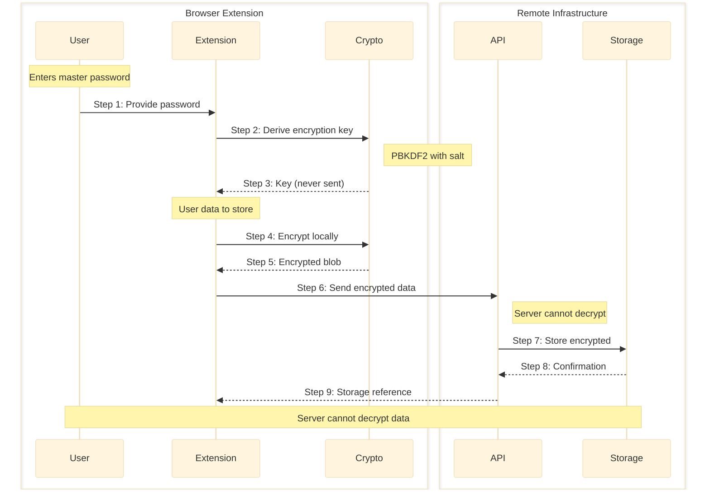
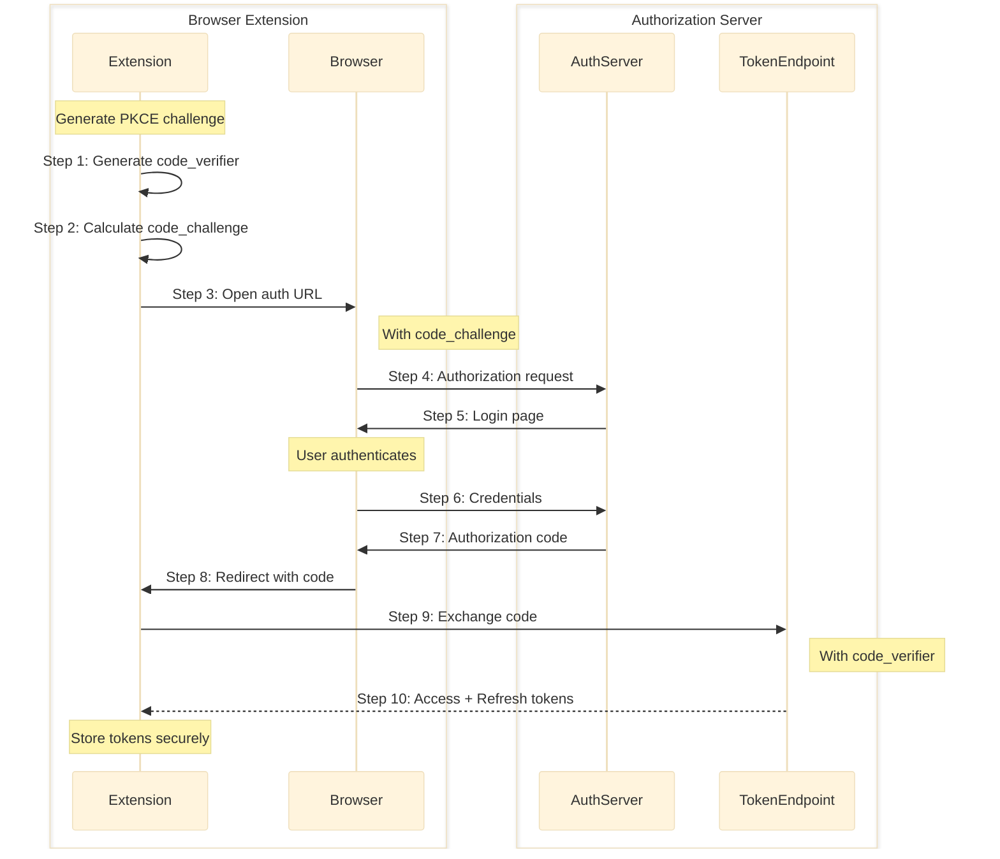
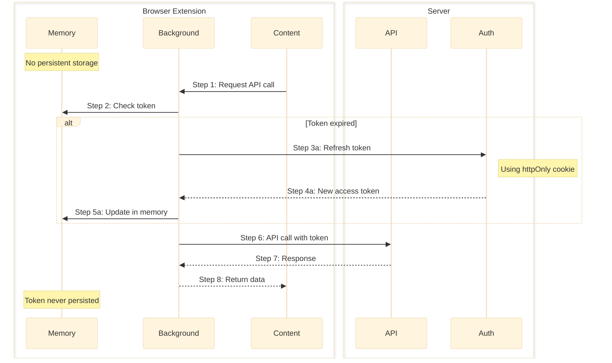
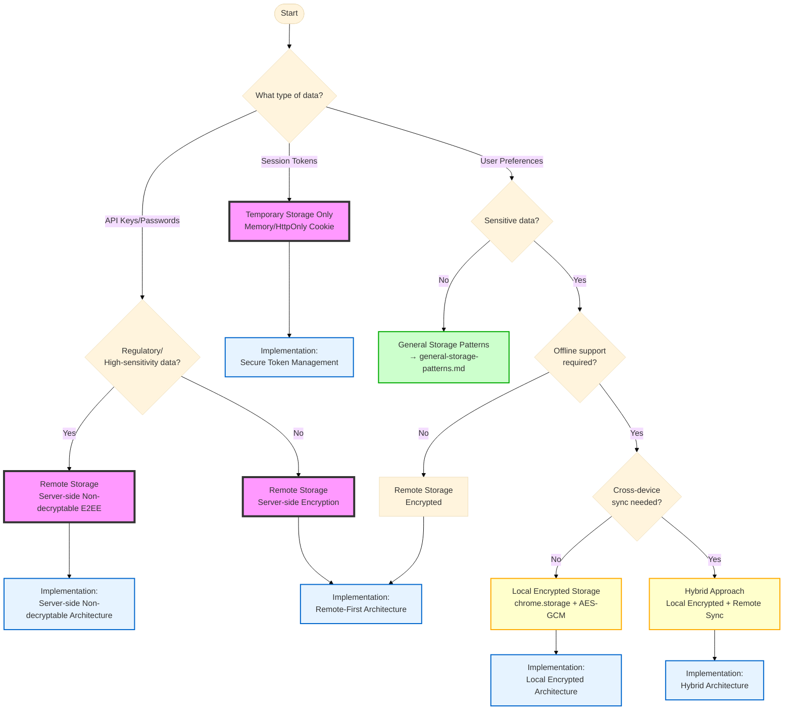

## Executive Summary

Comprehensive analysis of sensitive data storage architectures for browser extensions reveals that a **remote-first approach** is strongly recommended for 2024-2025, with local storage limited to non-sensitive metadata and cached references. Based on the LayerX Browser Extension Security Report 2025, 53% of enterprise users have installed extensions with 'high' or 'critical' risk scope that can access sensitive data including cookies, passwords, and browsing information, making local storage vulnerable to XSS attacks and extension compromise. Implementation requires Web Crypto API (AES-GCM) for client-side encryption, zero-knowledge architecture (server-side non-decryptable E2EE design) for server storage, and short-lived JWT tokens with OAuth2 PKCE flow for authentication.

**Target Audience**: Technical decision makers and security architects designing browser extension data storage strategies

## Prerequisites

### Required Knowledge

To fully understand the research findings and options presented in this document:

- **Browser Extension Security**
  - Manifest V3 Security Model: Understanding of service worker isolation and permission system
  - Content Script Security: Knowledge of injection attacks and XSS vulnerabilities
  - Extension Attack Vectors: Familiarity with common extension security threats
    - Reference: [Chrome Extensions Security Best Practices](https://developer.chrome.com/docs/extensions/develop/security-privacy/stay-secure)

- **Cryptography Fundamentals**
  - Symmetric Encryption: Understanding of AES-GCM and authenticated encryption
  - Key Derivation: Knowledge of PBKDF2 (600,000 iterations) and Argon2id (19456 (19 MiB), 2 iterations)
  - Web Crypto API: Experience with browser cryptographic primitives
    - Reference: [Web Crypto API - MDN](https://developer.mozilla.org/en-US/docs/Web/API/Web_Crypto_API)

- **Authentication Protocols**
  - OAuth 2.0 and PKCE: Understanding of authorization code flow with proof key
  - JWT Tokens: Knowledge of access/refresh token patterns
  - Zero-Knowledge Architecture: Understanding of end-to-end encryption (E2EE) where servers cannot decrypt user data (distinct from Zero-Knowledge Proofs/ZKP cryptographic protocols)
    - Reference: [OAuth 2.0 Security Best Practices](https://datatracker.ietf.org/doc/html/draft-ietf-oauth-security-topics)

## Problem Statement

### Context

Browser extensions require secure storage solutions for sensitive data including API keys, user credentials, authentication tokens, and personal information. The 2024-2025 security landscape shows increasing attacks on browser extensions, with malicious extensions capable of stealing data through XSS vulnerabilities and permission abuse. Traditional local storage approaches are inadequate for protecting sensitive information.

**Note**: This research focuses specifically on **sensitive data** (API keys, credentials, PII, tokens). For general data storage patterns and non-sensitive data management, refer to:
→ @docs/architecture/researches/2025-08-15-general-storage-patterns.md

### Requirements

- Protect sensitive data from malicious extensions and XSS attacks
- Support cross-device data access without exposing credentials
- Maintain user privacy with zero-knowledge architecture
- Enable secure API communication with minimal token exposure
- Comply with data protection regulations (GDPR, CCPA, HIPAA)
- Minimize attack surface while maintaining performance
- Support offline scenarios with secure caching strategies

## Excluded Technologies

### Storage Approaches Not Considered

The following approaches were excluded from evaluation due to critical security issues:

**LocalStorage/SessionStorage for Sensitive Data**

- **Reason**: Vulnerable to XSS attacks, accessible via JavaScript
- **Last Update**: N/A (native API)
- **Known Issues**: No encryption, synchronous API, content script access
- **Alternative**: Remote server storage with encrypted cache

**Certificate Pinning (HPKP)**

- **Reason**: Deprecated practice, more risk than benefit
- **Last Update**: HPKP deprecated in 2017, removed from Chrome 68 in 2018
- **Known Issues**: Maintenance burden, certificate rotation problems, risk of self-DoS
- **Alternative**: Certificate Transparency (CT) monitoring for detection (Note: CT provides monitoring/detection, not prevention. Domain owners must configure monitoring and respond to detected issues - not an automatic prevention mechanism)

**Plain Text Storage**

- **Reason**: Fundamental security violation
- **Last Update**: N/A
- **Known Issues**: Direct data exposure, compliance violations
- **Alternative**: Always use encryption (AES-GCM minimum)

_Note: These approaches are considered security anti-patterns for sensitive data storage in modern browser extensions._

## Architecture Assessment

### Option 1: Remote-First Architecture

**Overview**
Store all sensitive data on remote servers with client-side encryption, keeping only non-sensitive references and metadata locally. This approach minimizes the attack surface by ensuring sensitive data never persists in the extension storage.

**Key Features**

- Server-side encrypted storage with zero-knowledge design
- Client-side encryption before transmission
- Local storage limited to reference IDs and metadata
- Session-based memory caching for performance
- Automatic token rotation and refresh

**Implementation Example**

```typescript
// Helper function for base64url encoding (recommended for large buffers)
function base64urlEncode(buffer: ArrayBuffer): string {
  const bytes = new Uint8Array(buffer);
  let binary = "";
  bytes.forEach((byte) => (binary += String.fromCharCode(byte)));
  return btoa(binary).replace(/\+/g, "-").replace(/\//g, "_").replace(/=/g, "");
}

function base64urlDecode(str: string): ArrayBuffer {
  // Add padding if necessary
  str = (str + "===").slice(0, str.length + (str.length % 4));
  const binary = atob(str.replace(/-/g, "+").replace(/_/g, "/"));
  const bytes = new Uint8Array(binary.length);
  for (let i = 0; i < binary.length; i++) {
    bytes[i] = binary.charCodeAt(i);
  }
  return bytes.buffer;
}

class RemoteFirstArchitecture {
  private memoryCache = new Map<string, any>();
  private readonly apiEndpoint = "https://api.secure.example.com/v1";

  async storeSensitiveData(key: string, data: any): Promise<string> {
    // Step 1: Client-side encryption
    const encryptedPayload = await this.encryptE2E(data);

    // Step 2: Send to server (never store locally)
    const response = await fetch(`${this.apiEndpoint}/secure-storage`, {
      method: "POST",
      headers: {
        Authorization: `Bearer ${await this.getAccessToken()}`,
        "Content-Type": "application/json",
      },
      body: JSON.stringify({
        key,
        payload: encryptedPayload,
        timestamp: Date.now(),
      }),
    });

    const { referenceId } = await response.json();

    // Step 3: Store only reference locally
    await chrome.storage.local.set({
      [`ref:${key}`]: {
        id: referenceId,
        cached: false,
        lastAccessed: Date.now(),
      },
    });

    return referenceId;
  }

  async retrieveSensitiveData(key: string): Promise<any> {
    // Check memory cache first
    if (this.memoryCache.has(key)) {
      return this.memoryCache.get(key);
    }

    // Fetch from server
    const ref = await this.getReference(key);
    const response = await fetch(
      `${this.apiEndpoint}/secure-storage/${ref.id}`,
      {
        headers: {
          Authorization: `Bearer ${await this.getAccessToken()}`,
        },
      },
    );

    const encryptedData = await response.json();
    const decrypted = await this.decryptE2E(encryptedData.payload);

    // Cache in memory only
    this.memoryCache.set(key, decrypted);
    return decrypted;
  }
}
```

**Pros**

- Maximum security - sensitive data never stored locally
- Zero-knowledge architecture possible
- Centralized audit logging and monitoring
- Simplified compliance with regulations
- Cross-device synchronization built-in

**Cons**

- Requires internet connectivity
- Additional infrastructure cost
- Latency for data retrieval
- Complex implementation
- Server dependency

**Metrics**

- **Security Level**: Highest
- **Implementation Complexity**: High
- **Performance Impact**: 50-200ms per operation\*
- **Infrastructure Cost**: $10-500/month depending on scale\*

\*Note: Performance and cost estimates are based on typical implementations and may vary significantly by actual implementation and scale

### Option 2: Local-First with Encryption

**Overview**
Store encrypted sensitive data locally using Web Crypto API, with optional sync to remote servers for backup. This approach provides offline capability while maintaining security through client-side encryption.

**Key Features**

- Client-side AES-GCM encryption
- Key derivation from user password (PBKDF2)
- Local storage with encrypted blobs
- Optional remote backup
- Offline-first operation

**Implementation Example**

```typescript
class LocalEncryptedArchitecture {
  private encryptionKey: CryptoKey | null = null;

  async initialize(userPassword: string): Promise<void> {
    const salt = await this.getOrCreateSalt();
    this.encryptionKey = await this.deriveKey(userPassword, salt);
  }

  async storeSensitiveData(key: string, data: any): Promise<void> {
    if (!this.encryptionKey) throw new Error("Not initialized");

    // Encrypt data locally
    const iv = crypto.getRandomValues(new Uint8Array(12));
    const encrypted = await crypto.subtle.encrypt(
      { name: "AES-GCM", iv, tagLength: 128 },
      this.encryptionKey,
      new TextEncoder().encode(JSON.stringify(data)),
    );

    // Store encrypted blob
    await chrome.storage.local.set({
      [`encrypted:${key}`]: {
        data: btoa(String.fromCharCode(...new Uint8Array(encrypted))),
        iv: btoa(String.fromCharCode(...iv)),
        timestamp: Date.now(),
      },
    });

    // Optional: Backup to server
    if (this.isOnline()) {
      await this.backupToServer(key, encrypted, iv);
    }
  }

  async retrieveSensitiveData(key: string): Promise<any> {
    const stored = await chrome.storage.local.get(`encrypted:${key}`);
    const encryptedData = stored[`encrypted:${key}`];

    if (!encryptedData) return null;

    const encrypted = Uint8Array.from(atob(encryptedData.data), (c) =>
      c.charCodeAt(0),
    );
    const iv = Uint8Array.from(atob(encryptedData.iv), (c) => c.charCodeAt(0));

    const decrypted = await crypto.subtle.decrypt(
      { name: "AES-GCM", iv, tagLength: 128 },
      this.encryptionKey,
      encrypted,
    );

    return JSON.parse(new TextDecoder().decode(decrypted));
  }
}
```

**Pros**

- Works offline
- Lower latency (no network calls)
- User controls their data
- No infrastructure required
- Simple deployment

**Cons**

- Vulnerable if extension is compromised
- Key management complexity
- No centralized monitoring
- Difficult cross-device sync
- Storage quota limitations

**Metrics**

- **Security Level**: Medium-High
- **Implementation Complexity**: Medium
- **Performance Impact**: 10-50ms per operation\*
- **Infrastructure Cost**: $0 (local only)

\*Note: Performance estimates are based on typical implementations and may vary by device capabilities and data size

### Option 3: Hybrid Architecture

**Overview**
Combine remote and local storage based on data sensitivity levels, with critical secrets stored remotely and less sensitive encrypted data cached locally for performance.

**Key Features**

- Tiered storage based on sensitivity
- Remote storage for high-value secrets
- Local encrypted cache for performance
- Intelligent sync strategies
- Fallback mechanisms

**Implementation Example**

```typescript
class HybridArchitecture {
  private sensitivityLevels = {
    CRITICAL: ["apiKeys", "passwords", "tokens"],
    HIGH: ["userData", "preferences"],
    MEDIUM: ["cache", "session"],
  };

  async storeData(
    key: string,
    data: any,
    level: "CRITICAL" | "HIGH" | "MEDIUM",
  ): Promise<void> {
    switch (level) {
      case "CRITICAL":
        // Never store locally, always remote
        await this.storeRemote(key, data);
        break;

      case "HIGH":
        // Encrypt locally, backup remotely
        await this.storeEncryptedLocal(key, data);
        await this.queueRemoteBackup(key, data);
        break;

      case "MEDIUM":
        // Local only with basic encryption
        await this.storeLocal(key, data);
        break;
    }
  }

  async retrieveData(key: string): Promise<any> {
    const level = this.getDataSensitivityLevel(key);

    // Try local cache first for non-critical
    if (level !== "CRITICAL") {
      const cached = await this.getLocalCache(key);
      if (cached && !this.isExpired(cached)) {
        return cached.data;
      }
    }

    // Fetch from appropriate source
    if (level === "CRITICAL") {
      return await this.fetchRemote(key);
    } else {
      return await this.fetchLocal(key);
    }
  }
}
```

**Pros**

- Balanced security and performance
- Flexible for different data types
- Optimized user experience
- Cost-effective
- Gradual migration path

**Cons**

- Complex implementation
- Multiple failure points
- Synchronization challenges
- Difficult to maintain consistency
- Higher testing burden

**Metrics**

- **Security Level**: Medium-High (varies by data)
- **Implementation Complexity**: Very High
- **Performance Impact**: 10-200ms (varies by operation and data location)\*
- **Infrastructure Cost**: $5-100/month\*

\*Note: Performance and cost estimates are based on typical implementations and may vary by actual hybrid architecture design

## Architecture Comparative Analysis

| Criteria              | Remote-First   | Local Encrypted | Hybrid    |
| --------------------- | -------------- | --------------- | --------- |
| Security Level        | Highest        | Medium-High     | Variable  |
| Offline Support       | Limited        | Full            | Partial   |
| Performance           | 50-200ms       | 10-50ms         | 10-200ms  |
| Implementation Effort | High           | Medium          | Very High |
| Infrastructure Cost   | High           | None            | Medium    |
| Compliance Ease       | Excellent      | Moderate        | Complex   |
| Cross-Device Sync     | Built-in       | Manual          | Partial   |
| Attack Surface        | Minimal        | Medium          | Variable  |
| Key Management        | Server-managed | User-managed    | Mixed     |
| Monitoring Capability | Centralized    | None            | Partial   |

## Implementation Strategies

### Strategy 1: Server-side Non-decryptable Remote Storage (E2EE)

**Note**: This implementation uses end-to-end encryption (E2EE) where servers cannot decrypt user data. While often marketed as "zero-knowledge architecture," this is distinct from Zero-Knowledge Proofs (ZKP) cryptographic protocols.

**Critical Security Principle**: In server-side non-decryptable architecture, encryption keys are derived from user passwords and never leave the client. The server stores only encrypted data and cannot decrypt it, providing maximum protection against server-side breaches.

#### Data Flow



#### Implementation

```typescript
class ServerNonDecryptableStrategy {
  private masterKey: CryptoKey | null = null;

  async initialize(masterPassword: string): Promise<void> {
    // Derive key from password - never leaves client
    const salt = await this.getOrCreateUserSalt();
    const keyMaterial = await crypto.subtle.importKey(
      "raw",
      new TextEncoder().encode(masterPassword),
      "PBKDF2",
      false,
      ["deriveBits", "deriveKey"],
    );

    this.masterKey = await crypto.subtle.deriveKey(
      {
        name: "PBKDF2",
        salt,
        iterations: 600000, // OWASP 2024 recommendation for PBKDF2-HMAC-SHA256
        hash: "SHA-256",
      },
      keyMaterial,
      { name: "AES-GCM", length: 256 },
      false,
      ["encrypt", "decrypt"],
    );
  }

  async storeSecret(name: string, secret: any): Promise<void> {
    if (!this.masterKey) throw new Error("Not initialized");

    // Client-side encryption
    const iv = crypto.getRandomValues(new Uint8Array(12));
    const encrypted = await crypto.subtle.encrypt(
      { name: "AES-GCM", iv, tagLength: 128 },
      this.masterKey,
      new TextEncoder().encode(JSON.stringify(secret)),
    );

    // Send to server - server never sees plaintext
    await fetch("/api/e2ee-storage/store", {
      method: "POST",
      headers: {
        "Content-Type": "application/json",
        Authorization: `Bearer ${await this.getSessionToken()}`,
      },
      body: JSON.stringify({
        name,
        encryptedData: base64urlEncode(encrypted),
        iv: base64urlEncode(iv.buffer),
        metadata: {
          created: Date.now(),
          algorithm: "AES-GCM-256",
        },
      }),
    });
  }
}
```

**When to use**:

- Storing API keys, passwords, or credentials
- Regulatory compliance requirements
- Maximum security priority
- Cross-device synchronization needed

**When not to use**:

- Offline-first applications
- High-frequency data access
- Cost-sensitive projects
- Simple preference storage

**Best Practices**:

- Use minimum 600,000 PBKDF2 iterations (OWASP 2024 recommendation for PBKDF2-HMAC-SHA256)
- Consider Argon2id as a modern alternative to PBKDF2
- Implement key rotation schedules
- Add rate limiting on server
- Monitor for suspicious access patterns
- Implement secure key recovery mechanisms
- **Never store API keys or passwords locally, even encrypted**
- **Always validate that server cannot decrypt user data**

### Strategy 2: OAuth2 PKCE Authentication Flow

#### Data Flow



#### Implementation

```typescript
class OAuth2PKCEStrategy {
  private accessToken: string | null = null;
  private refreshToken: string | null = null;
  private tokenExpiry: number = 0;

  async authenticate(): Promise<void> {
    // Generate PKCE challenge
    const codeVerifier = this.generateCodeVerifier();
    const codeChallenge = await this.generateCodeChallenge(codeVerifier);

    // Build authorization URL
    const authUrl = new URL("https://auth.example.com/oauth/authorize");
    authUrl.searchParams.set("client_id", this.clientId);
    authUrl.searchParams.set("redirect_uri", chrome.identity.getRedirectURL());
    authUrl.searchParams.set("response_type", "code");
    authUrl.searchParams.set("scope", "api:read api:write");
    authUrl.searchParams.set("code_challenge", codeChallenge);
    authUrl.searchParams.set("code_challenge_method", "S256");
    authUrl.searchParams.set("state", crypto.randomUUID());

    // Launch auth flow
    const redirectUrl = await chrome.identity.launchWebAuthFlow({
      url: authUrl.toString(),
      interactive: true,
    });

    // Extract authorization code
    const url = new URL(redirectUrl);
    const code = url.searchParams.get("code");
    const state = url.searchParams.get("state");

    // Validate state
    if (state !== authUrl.searchParams.get("state")) {
      throw new Error("State mismatch - possible CSRF attack");
    }

    // Exchange code for tokens
    const tokenResponse = await fetch("https://auth.example.com/oauth/token", {
      method: "POST",
      headers: { "Content-Type": "application/json" },
      body: JSON.stringify({
        grant_type: "authorization_code",
        code,
        redirect_uri: chrome.identity.getRedirectURL(),
        client_id: this.clientId,
        code_verifier: codeVerifier,
      }),
    });

    const tokens = await tokenResponse.json();

    // Store access token in memory only (never persist)
    // Note: Consider DPoP (RFC 9449) for additional token binding security
    this.accessToken = tokens.access_token;
    // Refresh token should be managed by the server via HttpOnly cookies
    // Server should set: Set-Cookie: refresh_token=xxx; HttpOnly; Secure; SameSite=None; Path=/
    // Do NOT store refresh token in JavaScript accessible memory or storage
    this.tokenExpiry = Date.now() + tokens.expires_in * 1000;
  }

  private generateCodeVerifier(): string {
    const array = new Uint8Array(32);
    crypto.getRandomValues(array);
    return base64urlEncode(array.buffer);
  }

  private async generateCodeChallenge(verifier: string): Promise<string> {
    const encoder = new TextEncoder();
    const data = encoder.encode(verifier);
    const hash = await crypto.subtle.digest("SHA-256", data);
    return base64urlEncode(hash);
  }
}
```

**When to use**:

- Public clients (browser extensions)
- No client secret available
- Need secure authorization flow
- Third-party API integration

**When not to use**:

- Simple internal APIs
- Machine-to-machine communication
- When client credentials flow suffices

**Best Practices**:

- Always use PKCE for public clients
- Implement token rotation
- **Store access tokens in memory only, never persist**
- Use short-lived access tokens (5-15 minutes)
- **Use HttpOnly cookies for refresh tokens with SameSite=None; Secure**
- Implement proper token refresh logic with retry and backoff
- Clear tokens immediately on logout or authentication errors

### Strategy 3: Secure Token Management

#### Data Flow



#### Implementation

```typescript
class SecureTokenManager {
  private accessToken: string | null = null;
  private tokenExpiry: number = 0;
  private refreshPromise: Promise<string> | null = null;

  async getAccessToken(): Promise<string> {
    // Check if token is still valid
    if (this.accessToken && Date.now() < this.tokenExpiry - 30000) {
      return this.accessToken;
    }

    // Prevent concurrent refresh attempts
    if (this.refreshPromise) {
      return this.refreshPromise;
    }

    // Refresh token
    this.refreshPromise = this.refreshAccessToken();
    try {
      const token = await this.refreshPromise;
      return token;
    } finally {
      this.refreshPromise = null;
    }
  }

  private async refreshAccessToken(): Promise<string> {
    const response = await fetch("https://api.example.com/auth/refresh", {
      method: "POST",
      credentials: "include", // Include httpOnly cookies
      headers: {
        "X-Extension-Id": chrome.runtime.id,
        "X-Extension-Version": chrome.runtime.getManifest().version,
      },
    });

    if (!response.ok) {
      // Clear tokens and re-authenticate
      this.accessToken = null;
      this.tokenExpiry = 0;
      throw new Error("Token refresh failed");
    }

    const data = await response.json();

    // Store in memory only - never persist
    this.accessToken = data.access_token;
    this.tokenExpiry = Date.now() + data.expires_in * 1000;

    // Set up automatic refresh before expiry
    const refreshIn = (data.expires_in - 60) * 1000; // 1 minute before expiry
    setTimeout(() => this.getAccessToken(), refreshIn);

    return this.accessToken;
  }

  async makeAuthenticatedRequest(
    url: string,
    options: RequestInit = {},
  ): Promise<Response> {
    const token = await this.getAccessToken();

    return fetch(url, {
      ...options,
      headers: {
        ...options.headers,
        Authorization: `Bearer ${token}`,
        "X-Request-Id": crypto.randomUUID(),
      },
    });
  }

  clearTokens(): void {
    this.accessToken = null;
    this.tokenExpiry = 0;
  }
}
```

**When to use**:

- All browser extension API communications
- When handling OAuth tokens
- Third-party service integration
- Any authenticated requests

**When not to use**:

- Public APIs without authentication
- Static resource fetching

**Best Practices**:

- **Never persist tokens to storage (LocalStorage, IndexedDB, or chrome.storage)**
- Implement automatic token refresh before expiry
- Use httpOnly cookies for refresh tokens (with SameSite=None; Secure for cross-origin)
- Consider DPoP (RFC 9449) for sender-constrained tokens in public clients
- Add request retry logic with exponential backoff
- Clear tokens immediately on logout or authentication errors
- **Monitor for XSS vulnerabilities that could expose in-memory tokens**
- **Implement token binding to prevent token theft**

## Implementation Strategy Selection Guide

### Enhanced Decision Flow



### Decision Matrix

| Data Type                   | Recommended Storage                  | Security Level | Implementation Strategy                  | Rationale                                                                 |
| --------------------------- | ------------------------------------ | -------------- | ---------------------------------------- | ------------------------------------------------------------------------- |
| **API Keys/Passwords**      | Remote (Server-side Non-decryptable) | 🔴 Critical    | Server-side Non-decryptable Architecture | Should never be stored client-side. Completely eliminates XSS attack risk |
| **Session Tokens**          | Memory Only                          | 🔴 Critical    | Secure Token Management                  | Avoid LocalStorage/IndexedDB, manage in HttpOnly cookies or memory        |
| **Sensitive User Settings** | Context-Dependent                    | 🟡 High        | Local Encrypted / Hybrid                 | Choose based on offline and sync requirements                             |
| **General User Settings**   | Local                                | 🟢 Low         | General Storage Patterns                 | Non-sensitive data follows standard patterns                              |

### Security Principles

1. **API Keys & Passwords**
   - Never persist on client-side
   - Always manage server-side
   - Server-side non-decryptable encryption recommended (E2EE where server cannot decrypt)

2. **Session Tokens**
   - Avoid persistent storage to prevent XSS attacks
   - Manage in memory or HttpOnly cookies
   - Implement automatic refresh mechanisms

3. **Sensitive User Settings**
   - Use local encryption only when offline requirements exist
   - Use AES-GCM (256-bit) or stronger encryption
   - Use hybrid approach when sync is required

### Quick Decision Guide

```
Q: API keys or passwords?
A: → Remote storage (server-side non-decryptable E2EE)

Q: Session tokens?
A: → Memory only (never persist)

Q: Sensitive user settings + offline required?
A: → Local encrypted (AES-GCM)

Q: Sensitive user settings + sync required?
A: → Hybrid (local + remote)

Q: Non-sensitive data?
A: → See general storage patterns
```

**Important Note**: This guide focuses on sensitive data storage. For non-sensitive data storage options (user preferences, cached data, application state), refer to the general storage patterns research document @docs/architecture/researches/2025-08-15-general-storage-patterns.md.

## Analysis Summary

### Evaluation Results

The analysis reveals that remote-first architecture provides the highest security level for sensitive data storage in browser extensions, though it requires more complex implementation and infrastructure investment. Local encrypted storage offers good security with offline capability but increases attack surface. Hybrid approaches provide flexibility but add significant complexity.

### Key Considerations for Decision Making

- **Security Requirements**: Remote-first is essential for API keys, credentials, and PII based on 2024-2025 threat landscape
- **Compliance Obligations**: Zero-knowledge architecture simplifies GDPR/HIPAA compliance through server-side controls
- **Performance Constraints**: Local encryption provides 10-50ms operations vs 50-200ms for remote storage
- **Infrastructure Budget**: Remote storage costs $10-500/month while local storage has zero infrastructure cost
- **Development Resources**: Remote-first requires 2-3x more development effort than local encrypted storage (estimated based on typical projects)
- **User Experience**: Consider offline requirements and latency tolerance for your specific use case

### Trade-offs Analysis

- **Option 1: Remote-First Architecture**
  - Gains: Maximum security, centralized monitoring, compliance ease, cross-device sync
  - Costs: Internet dependency, infrastructure costs, implementation complexity, latency

- **Option 2: Local Encrypted Storage**
  - Gains: Offline capability, low latency, user control, zero infrastructure cost
  - Costs: Extension vulnerability risk, key management complexity, no central monitoring

- **Option 3: Hybrid Architecture**
  - Gains: Balanced security/performance, flexible data handling, gradual migration path
  - Costs: Very complex implementation, synchronization challenges, multiple failure points

### Risk Assessment

| Architecture    | Risk Level | Primary Risks                       | Mitigation Strategies                        |
| --------------- | ---------- | ----------------------------------- | -------------------------------------------- |
| Remote-First    | Low        | Server downtime, network dependency | Implement failover, cache non-sensitive data |
| Local Encrypted | Medium     | Extension compromise, key exposure  | Use strong encryption, secure key derivation |
| Hybrid          | Medium     | Sync conflicts, complexity bugs     | Extensive testing, clear data classification |

### Scenario-Based Analysis

- **If handling API keys or passwords**: Remote-first with zero-knowledge architecture is mandatory
- **If offline access is critical**: Local encrypted storage with optional remote backup
- **If regulatory compliance required**: Remote-first with audit logging and encryption
- **If cost is primary concern**: Local encrypted storage with Web Crypto API
- **If user base is security-conscious**: Zero-knowledge architecture regardless of storage location
- **If rapid development needed**: Start with remote-first using managed services
- **If storing non-sensitive data**: Refer to @docs/architecture/researches/2025-08-15-general-storage-patterns.md for optimal storage solutions

## Security Checklist

### Essential Security Measures

- [ ] **No LocalStorage for Sensitive Data**: Never use localStorage or sessionStorage for secrets
- [ ] **Session Token Handling**: Store session tokens in memory only or HttpOnly cookies, never in LocalStorage/IndexedDB
- [ ] **API Keys/Passwords**: Always store on remote server with zero-knowledge encryption, never on client
- [ ] **Client-Side Encryption**: Always encrypt before transmission using Web Crypto API (AES-GCM 256-bit minimum)
- [ ] **Zero-Knowledge Design**: Server should not be able to decrypt user data
- [ ] **Token Management**:
  - Access tokens: Memory only, 5-15 minutes expiry
  - Refresh tokens: HttpOnly cookies with SameSite=None; Secure
  - Never persist tokens to extension storage
- [ ] **HTTPS Only**: All API communication over TLS 1.3+
- [ ] **Input Validation**: Sanitize and validate all user inputs
- [ ] **CSP Headers**: Implement strict Content Security Policy (Note: MV3 enforces minimum CSP that cannot be relaxed)
- [ ] **Rate Limiting**: Prevent brute force and abuse
- [ ] **Audit Logging**: Log all sensitive operations
- [ ] **Error Handling**: Never leak sensitive information in errors

### Recommended Additional Measures

- [ ] **Certificate Transparency Monitoring**: Monitor CT logs for certificate issues (detection mechanism, not prevention)
- [ ] **Subresource Integrity**: Verify external resources
- [ ] **CORS Configuration**: Restrict cross-origin requests
- [ ] **Security Headers**: X-Frame-Options, X-Content-Type-Options
- [ ] **Penetration Testing**: Regular security assessments
- [ ] **Dependency Scanning**: Monitor for vulnerable packages
- [ ] **Key Rotation**: Implement automatic key rotation schedules
- [ ] **Breach Detection**: Monitor for unauthorized access patterns
- [ ] **Secure Development**: Follow OWASP guidelines
- [ ] **Incident Response**: Have a plan for security breaches

## References

### Security Guidelines

- [Chrome Extensions Security Best Practices](https://developer.chrome.com/docs/extensions/develop/migrate/improve-security) - Manifest V3 security improvements
- [OWASP Password Storage Cheat Sheet](https://cheatsheetseries.owasp.org/cheatsheets/Password_Storage_Cheat_Sheet.html) - 2025 recommendations: Argon2id preferred, PBKDF2-HMAC-SHA256 with 600,000 iterations
- [Web Crypto API Specification](https://www.w3.org/TR/webcrypto/) - W3C Level 2 specification
- [OAuth 2.0 Security Best Current Practice (RFC 9700)](https://datatracker.ietf.org/doc/html/draft-ietf-oauth-security-topics) - IETF January 2025 Best Current Practice (BCP 240)
- [OAuth 2.0 DPoP (RFC 9449)](https://datatracker.ietf.org/doc/html/rfc9449) - Demonstrating Proof of Possession for sender-constrained tokens

### Research Sources

- [LayerX Browser Extension Security Report 2025](https://thehackernews.com/2025/04/majority-of-browser-extensions-can.html) - "53% of enterprise users have installed extensions with 'high' or 'critical' risk scope"
- [Analysis of Advanced Malicious Chrome Extension (2025)](https://palant.info/2025/02/03/analysis-of-an-advanced-malicious-chrome-extension/) - Wladimir Palant's technical analysis
- [Popular Chrome Extensions Leak API Keys (2025)](https://thehackernews.com/2025/06/popular-chrome-extensions-leak-api-keys.html) - Symantec research on hard-coded credentials
- [Manifest V3 Security Limitations (2025)](https://www.techradar.com/pro/google-chrome-extensions-remain-a-security-risk-as-manifest-v3-fails-to-prevent-data-theft-and-malware-exploitation) - Ongoing vulnerabilities despite MV3
- [SquareX Research: MV3 Security Failures (2025)](https://cybernews.com/security/creating-malicious-chrome-extension-too-easy-manifest-mv3/) - Demonstrates data theft and malware still possible with MV3
- [Chrome Web Store Moderation Issues (2025)](https://palant.info/2025/01/13/chrome-web-store-is-a-mess/) - 920 spam extensions documented

### Implementation References

- [W3C Web Cryptography API Level 2](https://w3c.github.io/webcrypto/) - Official specification
- [MDN Web Crypto API Guide](https://developer.mozilla.org/en-US/docs/Web/API/Web_Crypto_API) - AES-GCM implementation examples
- [Chrome Identity API Documentation](https://developer.chrome.com/docs/extensions/reference/api/identity) - OAuth2 flow for extensions
- [JWT Security Best Practices (Curity)](https://curity.io/resources/learn/jwt-best-practices/) - Token management guidelines
- [OAuth 2.0 for Browser-Based Applications](https://datatracker.ietf.org/doc/html/draft-ietf-oauth-browser-based-apps) - IETF draft-25 (expires January 2026), browser app guidelines
- [Zero-Knowledge Encryption Explained (2025)](https://www.hivenet.com/post/zero-knowledge-encryption-the-ultimate-guide-to-unbreakable-data-security) - E2EE server non-decryptable architecture

## Appendix

### Information Sources Consulted

- **WebSearch**: Browser extension security 2024-2025, OAuth PKCE implementation, zero-knowledge architecture, JWT token management best practices
- **Security Research**: Analysis of browser extension attack vectors, XSS vulnerability reports, certificate pinning deprecation
- **Industry Reports**: LayerX Browser Security Report 2025, ACM security analysis, Google Security Blog

### Search Queries Used

```
browser extension sensitive data storage architecture remote server vs local 2024 2025
browser extension OAuth JWT token management secure authentication 2024 2025
zero knowledge architecture browser extension end-to-end encryption E2EE 2024 2025
browser extension secure API communication HTTPS TLS certificate pinning 2024 2025
```

### Key Statistics

- 53% of enterprise users have installed extensions with high/critical risk scope (LayerX Browser Extension Security Report 2025, Page 3)
- 26% of enterprise extensions are sideloaded without vetting
- 51% of extensions haven't been updated in over a year
- 7.5% of employees risk data exposure through GenAI tools
- 20% of users have at least one GenAI extension installed

### Limitations

- Performance benchmarks are estimates based on typical implementations
- Infrastructure costs vary significantly by provider and scale
- Security landscape evolves rapidly, requiring continuous updates
- Regulatory requirements vary by jurisdiction and industry
