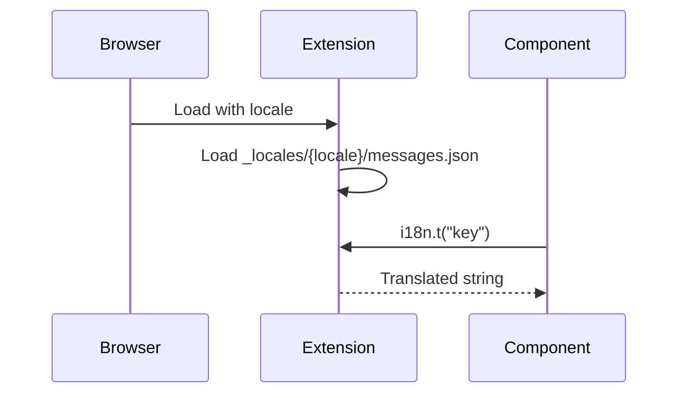
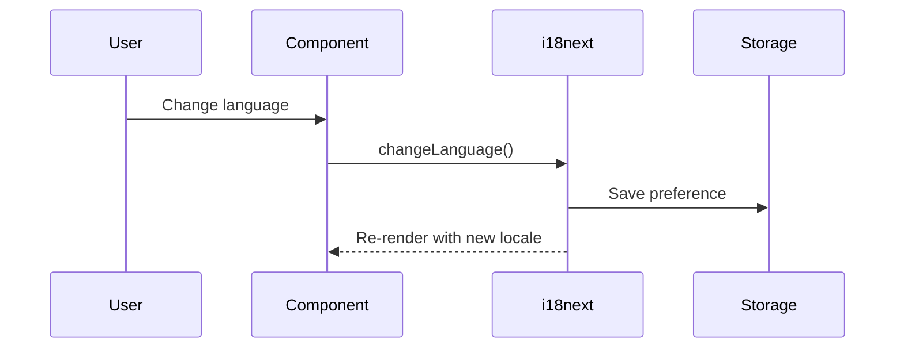
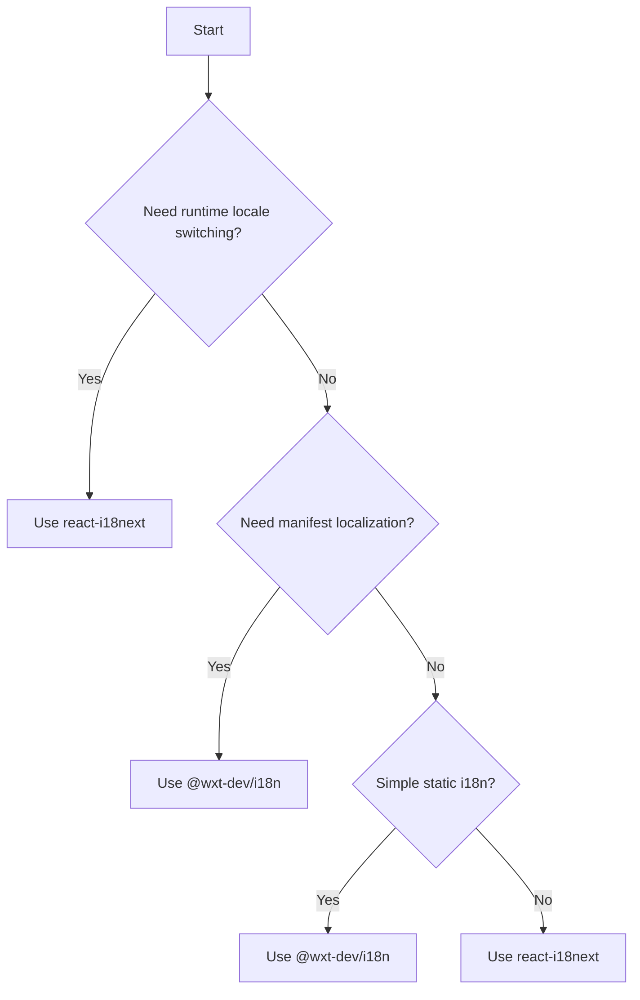

## Executive Summary

For browser extensions requiring runtime language switching, `react-i18next` is the recommended solution despite losing manifest.json localization capabilities. While `@wxt-dev/i18n` provides better browser extension integration, it fundamentally cannot support dynamic locale changes due to browser.i18n API limitations. The trade-off of using react-i18next (no manifest localization, larger bundle) is acceptable when runtime language switching is a core requirement.

**Target Audience**: Browser extension developers using WXT framework, Frontend engineers implementing i18n

## Prerequisites

### Required Knowledge

To fully understand and implement the recommendations in this document:

- **Core Technologies**:
  - Browser Extension APIs: Understanding of manifest.json, content scripts, and background workers
  - Web Extensions i18n: Familiarity with browser.i18n.getMessage API
- **Programming Languages**:
  - TypeScript: Intermediate proficiency
  - React: Component composition and hooks

- **Frameworks & Tools**:
  - WXT Framework: Basic understanding of entrypoints and module system
  - @wxt-dev/i18n: Type-safe wrapper for browser i18n APIs

## Problem Statement

### Context

The current implementation attempts to add runtime locale switching to a WXT browser extension using `@wxt-dev/i18n`. However, research reveals that the browser.i18n API fundamentally does not support runtime locale changes, leading to overly complex workarounds that don't align with browser extension architecture.

### Requirements

- Type-safe internationalization for all UI components
- Support for English and Japanese locales
- **Runtime language switching capability** (critical requirement)
- Consistent translation across popup, options, and content scripts
- Manifest.json localization support (nice to have, not critical)
- Minimal bundle size impact

### Success Criteria

- All user-facing text is translatable
- Type safety for translation keys
- Zero runtime errors from missing translations
- Clean, maintainable implementation

## Research Methodology

### Information Sources

- **Web Search**: "@wxt-dev/i18n browser extension", "browser.i18n runtime locale switching", "WXT framework internationalization"
- **Documentation Review**: WXT official docs, @wxt-dev/i18n npm package, Chrome extension i18n documentation
- **Community Insights**: WXT GitHub discussions (#930, #327), npm package statistics
- **Code Analysis**: wxt-dev/wxt repository analysis via DeepWiki

### Evaluation Criteria

1. **Technical Fit**: Compatibility with browser extension architecture
2. **Performance**: Bundle size and runtime overhead
3. **Developer Experience**: Type safety and ease of use
4. **Maintenance**: Long-term viability and official support
5. **Security**: No runtime fetching of translation files

## Options Analysis

### Option 1: @wxt-dev/i18n (Native Browser i18n)

**Overview**
Type-safe wrapper around browser.i18n.getMessage with YAML/JSON support and VS Code integration.

**Key Features**

- Type generation for translation keys
- Support for YAML, JSON, TOML formats
- Manifest.json and CSS localization
- Synchronous translation loading
- Plural form support

**Implementation Example**

```typescript
// wxt.config.ts
export default defineConfig({
  modules: ["@wxt-dev/i18n/module"],
  manifest: {
    default_locale: "en"
  }
});

// Component usage
import { i18n } from "#i18n";

function Popup() {
  return <h1>{i18n.t("welcome.title")}</h1>;
}
```

**Pros**

- Official WXT module with first-class support
- Zero runtime overhead
- Type safety with auto-generated types
- Manifest and CSS localization support
- No bundle duplication

**Cons**

- No runtime locale switching
- Language determined by browser/OS settings
- Limited plural form support for complex languages

**Metrics**

- **NPM Weekly Downloads**: 1,841
- **GitHub Stars**: 4,400+ (WXT framework)
- **Last Updated**: 3 months ago
- **TypeScript Support**: Full

### Option 2: react-i18next

**Overview**
Comprehensive i18n solution with React integration, supporting dynamic locale switching and advanced features.

**Key Features**

- Runtime locale switching
- Lazy loading of translations
- Rich plural and formatting support
- React hooks and components
- Namespace support

**Implementation Example**

```typescript
// i18n.ts
import i18n from "i18next";
import { initReactI18next } from "react-i18next";

i18n.use(initReactI18next).init({
  resources: {
    en: { translation: enMessages },
    ja: { translation: jaMessages }
  },
  lng: "en",
  interpolation: { escapeValue: false }
});

// Component usage
import { useTranslation } from "react-i18next";

function Popup() {
  const { t, i18n } = useTranslation();
  return (
    <>
      <h1>{t("welcome.title")}</h1>
      <button onClick={() => i18n.changeLanguage("ja")}>日本語</button>
    </>
  );
}
```

**Pros**

- Full runtime locale switching
- Advanced i18n features
- Large ecosystem and community
- Extensive documentation

**Cons**

- Cannot localize manifest.json or CSS
- Larger bundle size (~40KB)
- Bundles translations in JavaScript
- More complex setup

**Metrics**

- **NPM Weekly Downloads**: 3,352,038
- **GitHub Stars**: 7,800+
- **Last Updated**: Active development
- **TypeScript Support**: Full

### Option 3: Custom Hybrid Solution

**Overview**
Attempting to combine @wxt-dev/i18n with custom runtime switching logic.

**Key Features**

- Uses @wxt-dev/i18n as base
- Fetches messages.json at runtime
- Storage-based locale persistence
- Message passing for sync

**Implementation Example**

```typescript
// lib/i18n.ts (Current problematic implementation)
class I18nRuntime {
  private overrideLocale: string | null = null;
  private overrideMessages: MessagesJson | null = null;

  async setLocale(locale: string): Promise<void> {
    this.overrideLocale = locale;
    await browser.storage.local.set({ language: locale });
    const url = browser.runtime.getURL(`_locales/${locale}/messages.json`);
    const res = await fetch(url);
    this.overrideMessages = await res.json();
  }

  t: typeof baseI18n.t = (key: unknown, ...args: unknown[]) => {
    if (this.overrideMessages) {
      return this.applySubstitutions(this.lookupMessage(key), args);
    }
    return baseI18n.t(key, ...args);
  };
}
```

**Pros**

- Attempts to provide runtime switching
- Maintains type safety from @wxt-dev/i18n

**Cons**

- Goes against browser extension architecture
- Complex and error-prone
- Runtime fetching impacts performance
- Requires page reload for changes
- Message passing complexity
- Not officially supported pattern

**Metrics**

- **NPM Weekly Downloads**: N/A (custom)
- **GitHub Stars**: N/A
- **Last Updated**: N/A
- **TypeScript Support**: Partial

## Comparison Matrix

| Criteria          | @wxt-dev/i18n      | react-i18next | Custom Hybrid         |
| ----------------- | ------------------ | ------------- | --------------------- |
| Runtime Switching | No                 | Yes           | Partial               |
| Performance       | Best (0KB runtime) | Good (~40KB)  | Poor (fetch overhead) |
| Learning Curve    | Low                | Medium        | High                  |
| Community Support | Active (WXT)       | Very Active   | None                  |
| Documentation     | Good               | Excellent     | None                  |
| Type Safety       | Full               | Full          | Partial               |
| Bundle Size       | Minimal            | 40KB+         | Minimal + runtime     |
| Maintenance Risk  | Low                | Low           | High                  |

## Implementation Patterns

### Pattern A: Browser-Native i18n (When runtime switching not needed)

#### Data Flow



#### Implementation

```typescript
// wxt.config.ts
export default defineConfig({
  modules: ["@wxt-dev/i18n/module"],
  manifest: {
    default_locale: "en",
    name: "__MSG_extension_name__",
    description: "__MSG_extension_description__"
  }
});

// locales/en.yml
extension_name: My Extension
extension_description: A helpful browser extension
popup:
  title: Welcome
  count: "Count is $1"

// locales/ja.yml
extension_name: 私の拡張機能
extension_description: 便利なブラウザ拡張機能
popup:
  title: ようこそ
  count: "カウントは $1"

// entrypoints/popup/App.tsx
import { i18n } from "#i18n";

function App() {
  const [count, setCount] = useState(0);

  return (
    <div>
      <h1>{i18n.t("popup.title")}</h1>
      <button onClick={() => setCount(c => c + 1)}>
        {i18n.t("popup.count", [count])}
      </button>
    </div>
  );
}
```

**When to use**:

- Building standard browser extensions
- Manifest localization is required
- Performance is critical
- Following browser standards is important

**Best Practices**:

- Use YAML for better readability
- Keep translation keys flat or shallow nested
- Error handling: Provide fallback keys for critical UI

### Pattern B: React-i18next Implementation (Recommended for runtime switching)

#### Data Flow



#### Implementation

```typescript
// lib/i18n-spa.ts
import i18n from "i18next";
import { initReactI18next } from "react-i18next";
import enTranslations from "./locales/en.json";
import jaTranslations from "./locales/ja.json";

i18n
  .use(initReactI18next)
  .init({
    resources: {
      en: { translation: enTranslations },
      ja: { translation: jaTranslations }
    },
    lng: "en",
    fallbackLng: "en",
    interpolation: {
      escapeValue: false
    }
  });

// App.tsx with language switcher
import { useTranslation } from "react-i18next";

function App() {
  const { t, i18n } = useTranslation();

  return (
    <div>
      <select onChange={(e) => i18n.changeLanguage(e.target.value)}>
        <option value="en">English</option>
        <option value="ja">日本語</option>
      </select>
      <h1>{t("welcome")}</h1>
    </div>
  );
}
```

**When to use**:

- Building complex SPAs within extension
- Runtime language switching is critical
- Manifest localization not needed

**Best Practices**:

- Lazy load large translation files
- Use namespaces for organization
- Implement proper loading states

## Decision Flow



## Recommendations

### Primary Recommendation

**react-i18next for Runtime Language Switching**

Given the critical requirement for runtime language switching, `react-i18next` is the recommended solution. While it cannot localize manifest.json and has a larger bundle size (~40KB), these trade-offs are acceptable when dynamic language switching is essential for user experience. The mature ecosystem and extensive documentation make it a reliable choice for production applications.

### Technologies to Use

**IMPORTANT: These are the ONLY technologies that should be used for this implementation**

#### Core Libraries

- **`react-i18next`**
  - npm package: `react-i18next`
  - Version: ^15.0.0
  - Installation: `pnpm add i18next react-i18next`
  - Purpose: Runtime language switching for React components
  - Selection reason: Mature solution with runtime switching capability

- **`i18next`**
  - npm package: `i18next`
  - Version: ^24.0.0
  - Installation: Included with react-i18next
  - Purpose: Core i18n framework
  - Selection reason: Required dependency for react-i18next

#### Supporting Libraries

- **`@wxt-dev/module-react`**
  - npm package: `@wxt-dev/module-react`
  - Version: Latest
  - Purpose: React integration for WXT
  - Selection reason: Official React support

#### Development Tools

- **VS Code i18n Ally**: Extension for managing translations
- **WXT CLI**: Built-in type generation and build tools

### Technologies NOT to Use

**CRITICAL: Do NOT use these technologies under any circumstances**

- **Custom Runtime Switching Solutions**
  - Reason: Violates browser extension architecture
  - Common mistake: Fetching messages.json at runtime
- **@wxt-dev/i18n with custom runtime switching**
  - Reason: Overly complex and goes against browser extension architecture
  - Alternative: Use react-i18next for proper runtime switching
- **vue-i18n in React projects**
  - Reason: Framework mismatch
  - Note: Only for Vue-based extensions

- **Dynamic imports for locale data**
  - Reason: Increases complexity and bundle size
  - Alternative: Let browser handle locale loading

### Alternative Scenarios

- **If runtime switching is NOT needed**: Use @wxt-dev/i18n for better extension integration
- **If manifest localization is critical**: Consider using @wxt-dev/i18n and guide users to browser settings

## References

- Related ADR: @docs/architecture/adr/2025-08-10-use-react-i18next-for-runtime-locale-switching.md
- WXT i18n Documentation: https://wxt.dev/guide/essentials/i18n
- @wxt-dev/i18n npm: https://www.npmjs.com/package/@wxt-dev/i18n
- Chrome i18n API: https://developer.chrome.com/docs/extensions/reference/i18n/
- Related Discussion: https://github.com/wxt-dev/wxt/discussions/930

## Appendix

### Search Queries Used

```
@wxt-dev/i18n browser extension WXT framework internationalization
browser.i18n runtime locale switching chrome extension
WXT framework i18n React TypeScript best practices
```

### Raw Performance Data

- @wxt-dev/i18n: 0KB runtime overhead (uses native browser APIs)
- react-i18next: ~40KB gzipped bundle size
- Custom solution: 0KB + runtime fetch overhead (variable)

### Additional Notes

The key insight from this research is that browser extensions have a fundamentally different i18n architecture than web applications. The browser.i18n API is designed to work with the browser's locale settings and cannot be changed at runtime. This is by design for security and consistency reasons. Attempting to work around this limitation leads to complex, fragile solutions that provide poor user experience.
