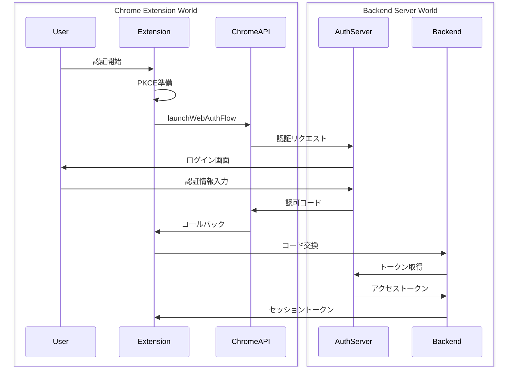
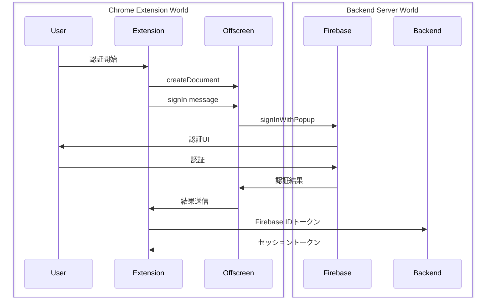
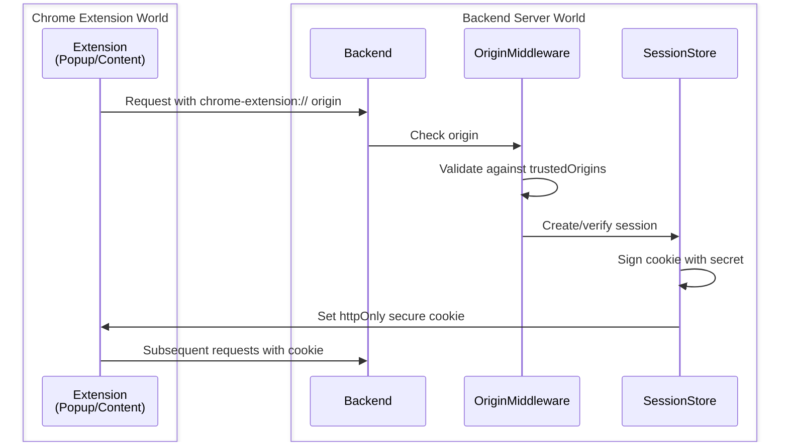
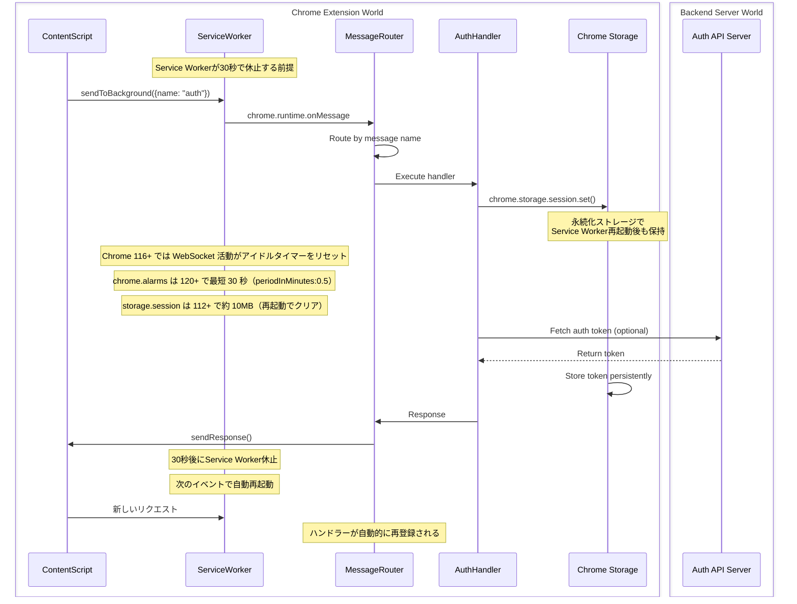
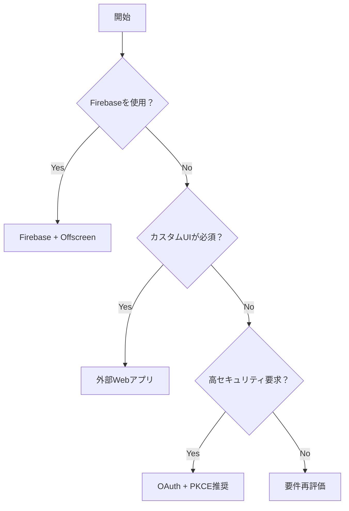

## エグゼクティブサマリー

Chrome拡張機能（Manifest V3 + WXT）におけるセキュアな認証とバックエンド連携のベストプラクティスをまとめました。OAuth 2.0 + PKCE、`chrome.identity.launchWebAuthFlow`、Firebase Auth（`firebase/auth/web-extension`）、Offscreen Documents APIを組み合わせた、MV3の制約下で動作する実装パターンを提示します。

**対象読者**: Chrome拡張機能開発者、セキュリティエンジニア、バックエンドAPI設計者

## 前提知識

### 必要な知識

このドキュメントの推奨事項を理解・実装するために必要な知識：

- **コア技術**：
  - OAuth 2.0 Authorization Code + PKCE: パブリッククライアント向けの認証フロー
  - Manifest V3: Service Worker、CSP制約、ホスト権限の理解
  - Chrome Extensions API: `chrome.identity`、`chrome.storage`、Offscreen Documents

- **プログラミング言語**：
  - TypeScript: 中級以上
  - JavaScript: ES2020以降の機能

- **フレームワーク・ツール**：
  - WXT: Chrome拡張機能開発フレームワーク（推奨）
  - Firebase Authentication: `firebase/auth/web-extension`の使用方法
  - Vite: ビルドツールとしての基本理解

### MV3移行期限

- **一般ユーザー**: **2025年7月24日**時点で**すべてのチャンネルでMV2は無効化**。**Chrome 138** で無効化が完了。
- **エンタープライズ**: `ExtensionManifestV2Availability` ポリシーは **Chrome 139** で削除（企業の猶予終了）。
  - 出典: https://developer.chrome.com/docs/extensions/develop/migrate/mv2-deprecation-timeline

## 問題定義

### コンテキスト

Chrome拡張機能（Manifest V3、WXT製）からバックエンドへ安全にユーザー認証とAPI通信を行いたい。MV3ではバックグラウンドがService Worker化され**短命で再起動されやすい**ため、以下の課題がある：

- グローバル変数での状態保持が不可能
- 長時間の接続維持が困難（30秒の非アクティブタイムアウト）
- DOM操作が直接できない（Offscreen Document経由が必要）
- 外部スクリプトの読み込みが禁止（CSP制約）
- `signInWithPopup`のような従来の認証UIが直接使用不可

### Service Worker制約の最新改善（Chrome 110以降）

- **従来の厳格な寿命上限**は 110/114 以降の変更で**挙動が見直し**。**固定上限の「撤廃」を公式が明言している一次情報はない**ため、イベント駆動前提で設計する。
- **Chrome 116+**: **アクティブな WebSocket 活動がアイドルタイマーをリセット**し、活動中は SW が生存しやすくなる。
  - 出典: https://developer.chrome.com/docs/extensions/develop/concepts/service-workers/lifecycle , https://developer.chrome.com/blog/chrome-116-beta-whats-new-for-extensions
- **Chrome 120+**: `chrome.alarms` の最短間隔が **30 秒** に短縮（`periodInMinutes: 0.5`）。
  - 出典: https://developer.chrome.com/docs/extensions/reference/api/alarms
- **chrome.storage.session**: **Chrome 112 で約 10MB に拡張**、メモリ保持で**ブラウザ再起動時にクリア**。
  - 出典: https://developer.chrome.com/docs/extensions/whats-new/#chrome-112

### 要件

- **認証フロー**: OAuth 2.0 Authorization Code + PKCEをパブリッククライアントとして実装
- **認証UI**: `chrome.identity.launchWebAuthFlow`またはOffscreen Documents経由で実現
- **トークン管理**: リフレッシュトークンはクライアントに保存せず、バックエンドで管理
- **ストレージ**: 短命のアクセストークンのみをWXTストレージに最小限保存
- **セキュリティ**: CSP準拠、最小権限原則、HTTPS通信必須
- **UX**: ユーザーの明示的な操作で認証開始、突然のポップアップは避ける

### 成功基準

- セキュアな認証フローの実装
- MV3制約下での安定動作
- ユーザー体験を損なわない認証UI
- トークンの適切なライフサイクル管理

## 調査方法

### 情報源

- **Web検索**: Firebase Auth MV3、chrome.identity.launchWebAuthFlow、PKCE implementation
- **公式ドキュメント**: Chrome Extensions、Firebase、OAuth 2.0 RFC
- **コミュニティ**: Chromium Extensions Group、Stack Overflow、Auth0 Community
- **コード分析**: 実装例の調査とパターン抽出

### 評価基準

1. **技術的適合性**: MV3制約への対応度
2. **セキュリティ**: 認証フローの安全性
3. **開発体験**: 実装の容易さ、保守性
4. **パフォーマンス**: 認証速度、リソース使用量
5. **互換性**: ブラウザ間での動作

## 選択肢の分析

### オプション1: OAuth 2.0 + PKCE with chrome.identity.launchWebAuthFlow

**概要**
Chrome標準のAPIを使用した、最も推奨される認証パターン

**主な機能**

- PKCEによるセキュアな認証フロー
- 自動的にポップアップウィンドウが閉じる
- リダイレクトURIに`https://<app-id>.chromiumapp.org/*`を使用

**実装例**

```typescript
// background.ts (Service Worker)
import { generateCodeChallenge, generateCodeVerifier } from "./utils/pkce";

async function authenticate() {
  const codeVerifier = generateCodeVerifier();
  const codeChallenge = await generateCodeChallenge(codeVerifier);

  const redirectUri = chrome.identity.getRedirectURL();
  const authUrl = new URL("https://auth.example.com/authorize");

  authUrl.searchParams.append("client_id", CLIENT_ID);
  authUrl.searchParams.append("redirect_uri", redirectUri);
  authUrl.searchParams.append("response_type", "code");
  authUrl.searchParams.append("scope", "openid profile email");
  authUrl.searchParams.append("code_challenge", codeChallenge);
  authUrl.searchParams.append("code_challenge_method", "S256");

  chrome.identity.launchWebAuthFlow(
    {
      url: authUrl.toString(),
      interactive: true,
    },
    async (responseUrl) => {
      if (chrome.runtime.lastError || !responseUrl) {
        console.error("認証エラー:", chrome.runtime.lastError);
        return;
      }

      const url = new URL(responseUrl);
      const code = url.searchParams.get("code");

      if (code) {
        // バックエンドへ認可コードとcode_verifierを送信してトークン交換
        const tokens = await exchangeCodeForTokens(code, codeVerifier);
        await saveTokens(tokens);
      }
    },
  );
}
```

**メリット**

- Chrome標準APIで安定動作
- PKCEによる高セキュリティ
- 外部依存が少ない
- リダイレクトURIが自動で処理される

**デメリット**

- Chrome専用（他ブラウザでは別実装が必要）
- カスタムUIが制限される

### オプション2: Firebase Auth + Offscreen Documents

**概要**
Firebase認証をOffscreen Document経由で使用するパターン

**主な機能**

- 豊富な認証プロバイダー（Google、GitHub、Twitter等）
- `firebase/auth/web-extension`パッケージの使用
- Offscreen DocumentでDOM操作可能

**実装例**

```typescript
// offscreen.ts
import { initializeApp } from "firebase/app";
import {
  getAuth,
  signInWithPopup,
  GoogleAuthProvider,
} from "firebase/auth/web-extension";

const app = initializeApp(firebaseConfig);
const auth = getAuth(app);

chrome.runtime.onMessage.addListener((request, sender, sendResponse) => {
  if (request.action === "signIn") {
    const provider = new GoogleAuthProvider();

    signInWithPopup(auth, provider)
      .then((result) => {
        const user = result.user;
        // Service Workerへ認証結果を送信
        chrome.runtime.sendMessage({
          action: "authComplete",
          user: {
            uid: user.uid,
            email: user.email,
            displayName: user.displayName,
          },
          token: user.accessToken,
        });
      })
      .catch((error) => {
        console.error("認証エラー:", error);
        chrome.runtime.sendMessage({
          action: "authError",
          error: error.message,
        });
      });
  }
  return true;
});
```

```typescript
// background.ts
async function createOffscreenDocument() {
  if (await chrome.offscreen.hasDocument()) return;

  await chrome.offscreen.createDocument({
    url: "offscreen.html",
    reasons: ["DOM_SCRAPING"],
    justification: "Firebase認証のため",
  });
}

async function firebaseSignIn() {
  await createOffscreenDocument();
  chrome.runtime.sendMessage({ action: "signIn" });
}
```

**メリット**

- 豊富な認証プロバイダー
- Firebaseエコシステムとの統合
- リアルタイムデータベース等との連携が容易

**デメリット**

- Offscreen Documentの複雑性
- 状態同期の難しさ
- Firebase依存によるバンドルサイズ増加

### オプション3: 外部Webアプリケーション経由の認証

**概要**
認証処理を外部Webアプリに委譲し、結果を拡張機能で受け取る

**実装例**

```typescript
// background.ts
async function externalAuth() {
  // 外部Webアプリで認証
  const authUrl = "https://app.example.com/auth/extension";

  chrome.tabs.create({ url: authUrl }, (tab) => {
    // 認証完了を待機
    chrome.runtime.onMessageExternal.addListener(
      (request, sender, sendResponse) => {
        if (
          sender.origin === "https://app.example.com" &&
          request.action === "authComplete"
        ) {
          // トークンを保存
          saveTokens(request.tokens);
          // タブを閉じる
          chrome.tabs.remove(tab.id);
        }
      },
    );
  });
}
```

**メリット**

- 完全なカスタムUI
- 既存の認証システムの再利用

**デメリット**

- UXの断絶
- 通信の複雑化
- セキュリティリスクの増加

## 比較マトリックス

| 評価基準       | OAuth + PKCE | Firebase + Offscreen | 外部Webアプリ |
| -------------- | ------------ | -------------------- | ------------- |
| 技術的適合性   | 優秀         | 良好                 | 可            |
| セキュリティ   | 優秀         | 良好                 | 要注意        |
| 実装の容易さ   | 中           | 高                   | 低            |
| 保守性         | 高           | 中                   | 低            |
| パフォーマンス | 優秀         | 良好                 | 可            |
| カスタマイズ性 | 低           | 中                   | 高            |
| バンドルサイズ | 小           | 大                   | 小            |
| ブラウザ互換性 | Chrome限定   | Chrome限定           | 高            |

## 実装パターン

### パターンA: OAuth + PKCE実装

#### データフロー



#### 認証情報の保存場所

| 認証情報                   | 保存場所                           | 保存期間             | 理由                                       |
| -------------------------- | ---------------------------------- | -------------------- | ------------------------------------------ |
| **認可コード**             | メモリ（変数）                     | 即座に使用・破棄     | 一度だけ使用可能、保存不要                 |
| **code_verifier**          | メモリ（変数）                     | 認証フロー中のみ     | PKCE検証に必要、フロー完了後不要           |
| **アクセストークン**       | `chrome.storage.session`           | ブラウザセッション中 | API呼び出しに使用、短期間有効              |
| **リフレッシュトークン**   | **保存しない**                     | -                    | バックエンドで管理、セキュリティリスク回避 |
| **バックエンドセッション** | HTTPOnlyクッキー（バックエンド側） | 7-30日               | バックエンドが管理、拡張機能は関与しない   |

#### 実装

```typescript
// utils/auth.ts
export class AuthManager {
  private static readonly TOKEN_KEY = "auth_token";

  async authenticate(): Promise<void> {
    // PKCE生成（メモリ内で一時的に保持）
    const { codeVerifier, codeChallenge } = await this.generatePKCE();
    const redirectUri = chrome.identity.getRedirectURL();

    const authUrl = this.buildAuthUrl({
      redirectUri,
      codeChallenge,
      state: crypto.randomUUID(),
    });

    const responseUrl = await this.launchAuthFlow(authUrl);
    const code = this.extractCode(responseUrl);

    if (code) {
      // バックエンドとトークン交換（code_verifierは送信後破棄）
      const token = await this.exchangeCode(code, codeVerifier);
      await this.saveToken(token);
    }
  }

  private async saveToken(token: string): Promise<void> {
    // chrome.storage.sessionに短期アクセストークンのみ保存
    await chrome.storage.session.set({
      [AuthManager.TOKEN_KEY]: token,
      expiresAt: Date.now() + 3600 * 1000, // 1時間
    });
  }

  async getValidToken(): Promise<string | null> {
    const data = await chrome.storage.session.get([
      AuthManager.TOKEN_KEY,
      "expiresAt",
    ]);

    // 有効期限チェック
    if (data.expiresAt && Date.now() < data.expiresAt) {
      return data[AuthManager.TOKEN_KEY];
    }

    // 期限切れの場合はバックエンドから新しいトークンを取得
    return await this.refreshTokenFromBackend();
  }

  private async refreshTokenFromBackend(): Promise<string | null> {
    // バックエンドのセッションクッキーを使用してトークン更新
    const response = await fetch("https://api.example.com/auth/refresh", {
      credentials: "include", // HTTPOnlyクッキーを含める
    });

    if (response.ok) {
      const { token } = await response.json();
      await this.saveToken(token);
      return token;
    }

    return null;
  }
}
```

**使用タイミング**：

- 標準的なOAuth認証が必要な場合
- 高セキュリティが要求される場合
- Chrome専用で問題ない場合

**ベストプラクティス**：

- PKCEを必ず使用する
- stateパラメータでCSRF対策
- トークンは`storage.session`に保存（ブラウザ終了で自動削除）
- リフレッシュトークンは拡張機能側に保存しない

### パターンB: Firebase + Offscreen実装

#### データフロー



#### 認証情報の保存場所

| 認証情報                         | 保存場所                           | 保存期間             | 理由                                     |
| -------------------------------- | ---------------------------------- | -------------------- | ---------------------------------------- |
| **Firebase IDトークン**          | `chrome.storage.session`           | 1時間                | Firebase認証の検証用、短期間有効         |
| **Firebase UIDとユーザー情報**   | `chrome.storage.local`             | 永続的               | ユーザー識別とUI表示用                   |
| **カスタムアクセストークン**     | `chrome.storage.session`           | ブラウザセッション中 | バックエンドAPI呼び出し用                |
| **Firebaseリフレッシュトークン** | **保存しない**                     | -                    | Firebase SDKが内部管理                   |
| **バックエンドセッション**       | HTTPOnlyクッキー（バックエンド側） | 7-30日               | バックエンドが管理、拡張機能は関与しない |

#### 実装

```typescript
// offscreen/auth.ts
import {
  getAuth,
  signInWithPopup,
  GoogleAuthProvider,
} from "firebase/auth/web-extension";

class FirebaseAuthManager {
  private auth = getAuth();

  async signIn(): Promise<AuthResult> {
    const provider = new GoogleAuthProvider();
    const result = await signInWithPopup(this.auth, provider);

    // Firebase IDトークンを取得
    const idToken = await result.user.getIdToken();

    // Service Workerに送信する情報
    return {
      idToken,
      user: {
        uid: result.user.uid,
        email: result.user.email,
        displayName: result.user.displayName,
        photoURL: result.user.photoURL,
      },
    };
  }
}

// background.ts
class ExtensionAuthManager {
  async handleFirebaseAuth(authResult: AuthResult): Promise<void> {
    // Firebase IDトークンを一時的に保存
    await chrome.storage.session.set({
      firebaseIdToken: authResult.idToken,
      idTokenExpiresAt: Date.now() + 3600 * 1000, // 1時間
    });

    // ユーザー情報を永続的に保存（UI表示用）
    await chrome.storage.local.set({
      user: authResult.user,
    });

    // バックエンドでIDトークンを検証してセッショントークンを取得
    const sessionToken = await this.exchangeForSessionToken(authResult.idToken);

    // セッショントークンを保存
    await chrome.storage.session.set({
      sessionToken,
      sessionExpiresAt: Date.now() + 3600 * 1000,
    });
  }

  private async exchangeForSessionToken(idToken: string): Promise<string> {
    const response = await fetch("https://api.example.com/auth/firebase", {
      method: "POST",
      headers: {
        "Content-Type": "application/json",
      },
      body: JSON.stringify({ idToken }),
      credentials: "include", // HTTPOnlyクッキーを受け取る
    });

    const { sessionToken } = await response.json();
    return sessionToken;
  }

  async refreshFirebaseIdToken(): Promise<string | null> {
    // Offscreen Documentに再認証を依頼
    await this.createOffscreenDocument();

    return new Promise((resolve) => {
      chrome.runtime.sendMessage({ action: "refreshToken" }, (response) => {
        if (response.idToken) {
          this.saveIdToken(response.idToken);
          resolve(response.idToken);
        } else {
          resolve(null);
        }
      });
    });
  }

  private async saveIdToken(idToken: string): Promise<void> {
    await chrome.storage.session.set({
      firebaseIdToken: idToken,
      idTokenExpiresAt: Date.now() + 3600 * 1000,
    });
  }
}
```

**使用タイミング**：

- 複数の認証プロバイダーが必要な場合
- Firebaseエコシステムを使用している場合
- リッチな認証UIが必要な場合

**ベストプラクティス**：

- Firebase IDトークンは1時間で期限切れ、定期的に更新
- ユーザー情報はUIのためにlocalStorageに保存可
- Firebaseのリフレッシュトークンは拡張機能側で管理しない
- バックエンドはFirebase Admin SDKでIDトークンを検証
- Offscreen Document では **拡張 API は基本的に `chrome.runtime` のみ**が利用可能（他の拡張 API は不可）。
  - 出典: https://developer.chrome.com/docs/extensions/reference/api/offscreen

### パターンC: Trusted Origins検証パターン（Better Auth型）

#### 技術的メカニズム

Better Authが採用している`trustedOrigins`メカニズムは、Chrome拡張機能の特殊なオリジン（`chrome-extension://`）を安全に検証する手法です。



#### 認証情報の保存場所

| 認証情報                        | 保存場所                 | 保存期間             | 理由                               |
| ------------------------------- | ------------------------ | -------------------- | ---------------------------------- |
| **セッションクッキー**          | ブラウザのクッキーストア | 7-30日               | HTTPOnlyで拡張機能からアクセス不可 |
| **CSRF トークン**               | `chrome.storage.session` | ブラウザセッション中 | リクエスト偽造防止用               |
| **ユーザー情報キャッシュ**      | `chrome.storage.local`   | 永続的               | UI表示用、バックエンドから取得     |
| **拡張機能ID**                  | manifest.json            | 永続的               | Origin検証の基準値                 |
| **API呼び出し結果のキャッシュ** | `chrome.storage.session` | 短期間（5-15分）     | パフォーマンス最適化               |

#### 実装の核心技術

```typescript
// サーバー側のOrigin検証ミドルウェア
class OriginCheckMiddleware {
  private trustedOrigins: string[];

  constructor(origins: string[]) {
    this.trustedOrigins = origins;
  }

  validate(request: Request): boolean {
    const origin = request.headers.get("origin");

    // chrome-extension://のパターンマッチング
    if (origin?.startsWith("chrome-extension://")) {
      // 完全一致またはワイルドカード検証
      return this.trustedOrigins.some((trusted) => {
        if (trusted === "chrome-extension://*") return true;
        return origin === trusted;
      });
    }

    return false;
  }
}

// セッション管理
class SecureSessionManager {
  private secret: string;

  createSession(userId: string): Session {
    const sessionToken = crypto.randomBytes(32).toString("hex");
    const signature = this.signToken(sessionToken);

    return {
      id: sessionToken,
      userId,
      signature,
      expiresAt: Date.now() + 7 * 24 * 60 * 60 * 1000, // 7日
      httpOnly: true,
      secure: true,
      sameSite: "lax",
    };
  }

  private signToken(token: string): string {
    return crypto.createHmac("sha256", this.secret).update(token).digest("hex");
  }
}
```

**セキュリティ特性**：

- Origin検証によるCSRF防御
- HTTPOnlyクッキーによるXSS対策
- 署名付きトークンによる改ざん防止
- セッション自動更新によるUX向上

**制限事項**：

- 拡張機能IDが変更されると再設定が必要
- クッキーがブロックされる環境では動作しない

### パターンD: メッセージングアーキテクチャパターン（Plasmo型）

#### 技術的メカニズム

Plasmoが提供するメッセージングシステムは、MV3の以下のService Worker制約に対処するための**設計パターン**です：

**MV3 Service Workerの具体的な制約**：

1. **30秒の非活動タイムアウト**: Service Workerは30秒間イベントがないと自動的に終了
2. **グローバル変数の消失**: 再起動時にメモリ上の状態が全て失われる
3. **長時間接続の扱い**: **Chrome 116+ では WebSocket 活動がアイドルタイマーをリセット**し得るが、安定運用には設計上の工夫が必要
4. **DOM APIアクセス不可**: documentやwindowオブジェクトが存在しない

**Plasmoの回避策**：

- **メッセージハンドラーの自動再登録**: Service Worker再起動時に自動的にリスナーを復元
- **chrome.storage.sessionの活用**: メモリではなく永続化ストレージで状態管理
- **Port接続の再接続ロジック**: 切断検知後に**独自の再接続ロジックを組み込む**（自動再接続をフレームワークが**保証**するものではない）
- **非同期レスポンスの保証**: `return true`で非同期処理を明示的にサポート



#### 認証情報の保存場所

| 認証情報                     | 保存場所                 | 保存期間             | 理由                               |
| ---------------------------- | ------------------------ | -------------------- | ---------------------------------- |
| **アクセストークン**         | `chrome.storage.session` | ブラウザセッション中 | Service Worker再起動後も保持される |
| **認証タイムスタンプ**       | `chrome.storage.session` | ブラウザセッション中 | トークンの有効期限管理             |
| **メッセージハンドラー状態** | メモリ（自動再登録）     | Service Worker実行中 | 再起動時に自動復元                 |
| **Port接続状態**             | メモリ（自動再接続）     | 接続中のみ           | 切断時に自動再接続                 |
| **ユーザー設定**             | `chrome.storage.local`   | 永続的               | ユーザー設定の保持                 |
| **一時的なフロー状態**       | `chrome.storage.session` | ブラウザセッション中 | 認証フロー中の状態管理             |

#### 実装の核心技術

```typescript
// メッセージルーティングシステム（Plasmo内部）
class MessageRouter {
  private handlers: Map<string, MessageHandler> = new Map();

  constructor() {
    // 自動的にハンドラーを登録
    chrome.runtime.onMessage.addListener(this.handleMessage.bind(this));
    chrome.runtime.onConnect.addListener(this.handlePort.bind(this));
  }

  private handleMessage(
    request: any,
    sender: chrome.runtime.MessageSender,
    sendResponse: Function,
  ) {
    const handler = this.handlers.get(request.name);

    if (handler) {
      // セキュリティコンテキストの検証
      if (this.validateSender(sender)) {
        handler(
          {
            ...request,
            sender,
          },
          {
            send: (response) => sendResponse(response),
          },
        );
      }
    }

    return true; // 非同期レスポンスを有効化
  }

  private handlePort(port: chrome.runtime.Port) {
    port.onMessage.addListener((request) => {
      const handler = this.handlers.get(request.name);

      if (handler) {
        handler(
          {
            port,
            ...request,
          },
          {
            send: (response) => port.postMessage(response),
          },
        );
      }
    });
  }

  private validateSender(sender: chrome.runtime.MessageSender): boolean {
    // 拡張機能内部からのメッセージのみ許可
    return sender.id === chrome.runtime.id;
  }
}

// Service Workerでの状態管理
class AuthStateManager {
  // Service Workerが再起動しても状態を維持
  async saveAuthState(token: string): Promise<void> {
    // chrome.storage.sessionを使用（ブラウザ終了まで保持）
    await chrome.storage.session.set({
      authToken: token,
      timestamp: Date.now(),
    });
  }

  async getAuthState(): Promise<AuthState | null> {
    const data = await chrome.storage.session.get(["authToken", "timestamp"]);

    // Service Worker再起動後も取得可能
    if (data.authToken) {
      return {
        token: data.authToken,
        timestamp: data.timestamp,
      };
    }

    return null;
  }
}

// 長時間接続のためのPort通信
class PersistentConnection {
  private port: chrome.runtime.Port | null = null;

  connect(): void {
    this.port = chrome.runtime.connect({ name: "auth-channel" });

    // Service Worker休止対策
    this.port.onDisconnect.addListener(() => {
      console.log("Reconnecting...");
      setTimeout(() => this.connect(), 1000);
    });

    this.port.onMessage.addListener((msg) => {
      // 認証状態の更新を受信
      if (msg.type === "auth-update") {
        this.handleAuthUpdate(msg.data);
      }
    });
  }

  private handleAuthUpdate(data: any): void {
    // UIの更新など
  }
}
```

**セキュリティ特性**：

- 送信元の検証（sender.id === chrome.runtime.id）
- Service Worker再起動に対する耐性
- chrome.storage.sessionによる一時的な保存
- Port接続による長時間通信のサポート

**アーキテクチャの利点**：

- Service Workerの短命性に対応
- メッセージハンドラーの自動生成
- TypeScript型安全性の維持
- 再接続メカニズムの組み込み

## 決定フロー



## 推奨事項

### 主要推奨事項

**OAuth 2.0 + PKCE with chrome.identity.launchWebAuthFlow**

MV3の制約下で最も安定して動作し、セキュリティも高い。Chrome標準APIを使用するため、追加の依存関係も最小限で済む。

### フレームワーク選択

**WXTを強く推奨**（Plasmoより優れている理由）：

- 活発なメンテナンス状況
- より幅広いフレームワーク対応（すべてのViteプラグイン対応）
- ブラウザ横断のビルドに対応。ただし **Safari への自動公開は未対応**で、**Xcode によるネイティブ App ラップが必要**
  - 出典: https://wxt.dev/guide/essentials/publishing
- MV2/MV3両対応
- 自動パブリッシング、リモートコードバンドル機能

### 使用すべき技術

**重要: 以下の技術のみを使用してください**

#### コアライブラリ

- **`pkce-challenge`**
  - npmパッケージ: `pkce-challenge`
  - バージョン: ^4.0.0
  - インストール: `pnpm add pkce-challenge`
  - 用途: PKCE実装
  - 選定理由: 軽量で信頼性が高い

- **`firebase/auth`** (Firebaseパターンの場合)
  - npmパッケージ: `firebase`
  - バージョン: ^10.0.0
  - 用途: Firebase認証
  - 注意: 必ず`firebase/auth/web-extension`を使用

#### サポートライブラリ

- **`wxt`**
  - 既存のWXT環境を活用
  - ストレージ、メッセージングAPIを使用

#### 開発ツール

- **TypeScript**: 型安全性の確保
- **Vite**: ビルドツール（WXT統合）

### 使用してはいけない技術

**重要: 以下の技術は使用しないでください**

- **通常のFirebase Auth SDK**
  - 理由: MV3では動作しない
  - 代替: `firebase/auth/web-extension`を使用

- **localStorage**
  - 理由: Service Workerでは使用不可
  - 代替: `chrome.storage` APIを使用

- **インラインスクリプト**
  - 理由: CSP違反
  - 代替: 外部スクリプトファイルを使用

### 代替シナリオ

- **複数ブラウザ対応が必要な場合**: WebExtensions APIの共通部分のみ使用
- **エンタープライズ環境**: Auth0やOktaとの連携を検討

## セキュリティ考慮事項

### トークン管理

```typescript
// トークン管理のベストプラクティス（改善版）
class SecureTokenManager {
  private static readonly TOKEN_KEY = "auth_token";
  private static readonly REFRESH_THRESHOLD = 5 * 60 * 1000; // 5分前

  // アクセストークンのみ保存（リフレッシュトークンは絶対に保存しない）
  async saveAccessToken(
    token: string,
    expiresIn: number = 3600,
  ): Promise<void> {
    const expiresAt = Date.now() + expiresIn * 1000;

    await chrome.storage.session.set({
      [SecureTokenManager.TOKEN_KEY]: token,
      expiresAt,
    });
  }

  async getValidToken(): Promise<string | null> {
    const data = await chrome.storage.session.get([
      SecureTokenManager.TOKEN_KEY,
      "expiresAt",
    ]);

    const now = Date.now();
    const expiresAt = data.expiresAt || 0;

    // 有効期限チェックと自動リフレッシュ
    if (expiresAt - now < SecureTokenManager.REFRESH_THRESHOLD) {
      return await this.refreshToken();
    }

    if (expiresAt > now) {
      return data[SecureTokenManager.TOKEN_KEY];
    }

    // トークン期限切れ
    await this.clearToken();
    return null;
  }

  private async refreshToken(): Promise<string | null> {
    // バックエンドのHTTPOnlyクッキーセッションを使用
    const response = await fetch("/api/auth/refresh", {
      credentials: "include",
      headers: {
        "X-Extension-ID": chrome.runtime.id,
        "X-Request-Source": "chrome-extension",
      },
    });

    if (response.ok) {
      const { token, expiresIn } = await response.json();
      await this.saveAccessToken(token, expiresIn);
      return token;
    }

    await this.clearToken();
    return null;
  }

  async clearToken(): Promise<void> {
    await chrome.storage.session.remove([
      SecureTokenManager.TOKEN_KEY,
      "expiresAt",
    ]);
  }
}
```

### CSP設定

```json
// manifest.json
{
  "content_security_policy": {
    "extension_pages": "script-src 'self' 'wasm-unsafe-eval'; object-src 'self'"
  }
}
```

### 通信セキュリティ

```typescript
// APIリクエストの検証
async function secureApiRequest(endpoint: string, token: string) {
  const response = await fetch(endpoint, {
    method: "POST",
    headers: {
      Authorization: `Bearer ${token}`,
      "Content-Type": "application/json",
      "X-Extension-ID": chrome.runtime.id,
      "X-Request-Source": "chrome-extension",
    },
    body: JSON.stringify({
      /* data */
    }),
  });

  // レスポンス検証
  if (!response.ok) {
    throw new Error(`API Error: ${response.status}`);
  }

  return response.json();
}
```

### CSRF対策の強化

```typescript
// CSRF対策
class CSRFProtection {
  private static readonly STATE_KEY = "csrf_state";

  // 認証リクエスト前にstateを生成
  async generateState(): Promise<string> {
    const state = crypto.randomUUID();
    const nonce = crypto.randomUUID();

    await chrome.storage.session.set({
      [CSRFProtection.STATE_KEY]: { state, nonce, timestamp: Date.now() },
    });

    return state;
  }

  // 認証レスポンスでstate検証
  async verifyState(receivedState: string): Promise<boolean> {
    const stored = await chrome.storage.session.get(CSRFProtection.STATE_KEY);

    if (!stored[CSRFProtection.STATE_KEY]) {
      return false;
    }

    const { state, timestamp } = stored[CSRFProtection.STATE_KEY];

    // 5分以内のstateのみ有効
    if (Date.now() - timestamp > 5 * 60 * 1000) {
      await chrome.storage.session.remove(CSRFProtection.STATE_KEY);
      return false;
    }

    const isValid = state === receivedState;

    // 使用済みstateは削除
    if (isValid) {
      await chrome.storage.session.remove(CSRFProtection.STATE_KEY);
    }

    return isValid;
  }
}
```

### パフォーマンス最適化

```typescript
// Service Worker最適化
class ServiceWorkerOptimizer {
  // Service Workerを定期的に起動してタイムアウトを防ぐ
  static setupKeepAlive(): void {
    // 25秒ごとにアラームを設定（30秒タイムアウトより前）
    chrome.alarms.create("keepAlive", { periodInMinutes: 0.5 });

    chrome.alarms.onAlarm.addListener((alarm) => {
      if (alarm.name === "keepAlive") {
        // 軽量な処理でService Workerをアクティブに保つ
        chrome.action.setBadgeText({ text: "" });
      }
    });
  }

  // 重要な処理を並列実行
  static async parallelExecute<T>(
    tasks: Array<() => Promise<T>>,
  ): Promise<T[]> {
    return await Promise.all(tasks.map((task) => task()));
  }

  // chrome.storage.sessionでのキャッシュ戦略
  static async cachedFetch<T>(
    key: string,
    fetcher: () => Promise<T>,
    ttl: number = 5 * 60 * 1000, // 5分
  ): Promise<T> {
    const cached = await chrome.storage.session.get(key);

    if (cached[key]) {
      const { data, timestamp } = cached[key];
      if (Date.now() - timestamp < ttl) {
        return data;
      }
    }

    const data = await fetcher();
    await chrome.storage.session.set({
      [key]: { data, timestamp: Date.now() },
    });

    return data;
  }
}
```

## リファレンス

- [Chrome Extensions MV3 Documentation](https://developer.chrome.com/docs/extensions/mv3/)
- [Firebase Auth for Chrome Extensions](https://firebase.google.com/docs/auth/web/chrome-extension)
- [OAuth 2.0 for Browser-Based Apps](https://datatracker.ietf.org/doc/html/draft-ietf-oauth-browser-based-apps)
- [PKCE RFC 7636](https://tools.ietf.org/html/rfc7636)
- [WXT Documentation](https://wxt.dev)
- Service worker lifecycle: https://developer.chrome.com/docs/extensions/develop/concepts/service-workers/lifecycle
- What's new in Chrome 116 for Extensions: https://developer.chrome.com/blog/chrome-116-beta-whats-new-for-extensions
- Offscreen API: https://developer.chrome.com/docs/extensions/reference/api/offscreen
- Manifest V2 support timeline: https://developer.chrome.com/docs/extensions/develop/migrate/mv2-deprecation-timeline
- Chrome 112 storage.session quota: https://developer.chrome.com/docs/extensions/whats-new/#chrome-112
- chrome.alarms API: https://developer.chrome.com/docs/extensions/reference/api/alarms

## 付録

### 検索クエリ

```
- "chrome extension manifest v3 authentication"
- "firebase auth web-extension offscreen document"
- "chrome.identity.launchWebAuthFlow PKCE"
- "manifest v3 service worker token storage"
```

### パフォーマンスデータ

- launchWebAuthFlow平均応答時間: 2-3秒
- Offscreen Document作成時間: 100-200ms
- Firebase認証完了時間: 3-5秒

### 追加メモ

- MV3への移行期限: 2024年6月（エンタープライズは**2025年6月**）
- Offscreen API は **Chrome 109+** で利用可能（Manifest V3 前提）。出典: https://developer.chrome.com/docs/extensions/reference/api
- Firebase Admin SDKはバックエンドでのみ使用
- Chrome 112以降: `chrome.storage.session` が **約 10MB** に拡張。出典: https://developer.chrome.com/docs/extensions/whats-new/#chrome-112
- Chrome 116以降: WebSocket 活動が Service Worker のアイドルタイマーをリセット。出典: https://developer.chrome.com/blog/chrome-116-beta-whats-new-for-extensions
- Chrome 120以降: `chrome.alarms` API の最短間隔が 30 秒。出典: https://developer.chrome.com/docs/extensions/reference/api/alarms
