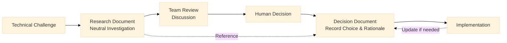
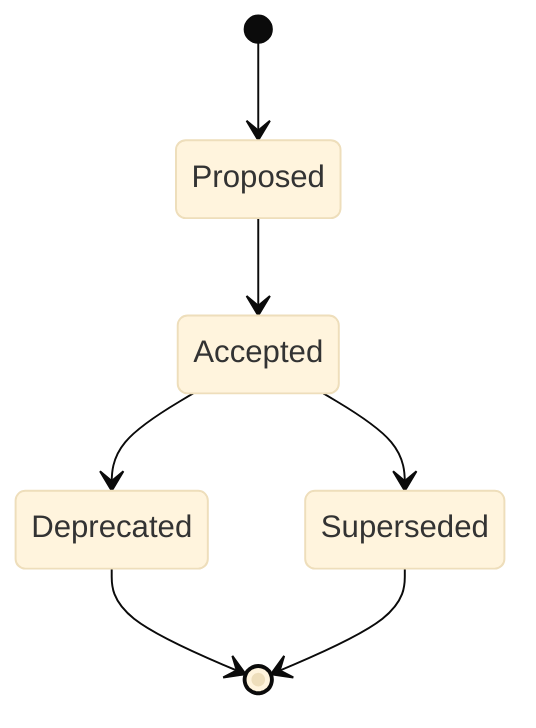

# Architecture Documentation

## Overview

This architecture documentation directory serves as the central repository for technical decision-making and architectural knowledge in our project. We follow a two-phase approach to ensure informed, well-documented technical choices:

- **Research Documents**: Comprehensive technical investigations and library evaluations
- **Decision Documents (ADRs)**: Formal architectural decisions based on research findings

## Target Audience

- **AI Agents**: Clear documentation prevents incorrect implementations
- **Developers**: Understand architectural decisions and patterns

### Key Benefits

- **Technical decisions are well-researched**: Every major technical choice is backed by thorough investigation and objective analysis
- **Architectural knowledge is preserved**: Future developers can understand not just what decisions were made, but why they were made
- **Consistency is maintained**: Teams follow established patterns and avoid repeating past mistakes
- **AI tools work effectively**: Clear documentation of approved libraries and anti-patterns prevents AI assistants from suggesting incorrect implementations
- **Decision-making is efficient**: The structured workflow prevents analysis paralysis while ensuring due diligence

By maintaining comprehensive research and decision records, we create a living knowledge base that evolves with the project while preserving historical context for future reference.

## Document Types

We maintain two types of architecture documentation that work together in a structured workflow:

### Overview Comparison

| Aspect               | Research Documents            | Decision Documents (ADRs)     |
| -------------------- | ----------------------------- | ----------------------------- |
| **Scope**            | Broad technical investigation | Single architectural decision |
| **Focus**            | Options evaluation            | Decision record               |
| **Audience**         | Technical evaluators          | Implementation team           |
| **Content Depth**    | Detailed analysis             | Concise decision              |
| **Code Examples**    | Extensive                     | Minimal                       |
| **Lifecycle**        | Static research               | Living document               |
| **Update Frequency** | Rarely updated                | Status changes over time      |

### File Organization

| Document Type             | Location                         | Naming Convention               | Template                                    |
| ------------------------- | -------------------------------- | ------------------------------- | ------------------------------------------- |
| Research Documents        | `@docs/architecture/researches/` | `YYYY-MM-DD-{topic-slug}.md`    | `@docs/architecture/_templates/research.md` |
| Decision Documents (ADRs) | `@docs/architecture/decisions/`  | `YYYY-MM-DD-{decision-slug}.md` | `@docs/architecture/_templates/decision.md` |

### Research Documents - Technical Investigation Reports

**Purpose**

- Objective, neutral technical evaluation of libraries, frameworks, and implementation patterns to provide comprehensive information for decision-making.
- Research documents present facts and analysis without making final recommendations.

**When to Create**

- Before introducing new libraries or frameworks
- When evaluating alternative solutions to technical problems
- Prior to major architectural changes or refactoring
- When investigating performance optimizations
- Before adopting new development patterns

**Required Content**

1. **Executive Summary** - Overview of findings and key insights (not recommendations)
2. **Problem Statement** - Requirements and constraints analysis
3. **Options Analysis** - Minimum 3 alternatives with:
   - Objective comparisons and pros/cons
   - Performance metrics and benchmarks
   - Bundle size and community health metrics
   - Security and maintenance considerations
   - Implementation patterns with code examples
4. **Comparison Matrix** - Systematic evaluation with consistent criteria
5. **Analysis Summary** - Key findings and considerations for decision-making
   - Evaluation results summary
   - Important trade-offs to consider
   - Risk factors and mitigation strategies
   - Scenario-based analysis ("If X is important, Option Y may be suitable")

**Important**: Research documents should NOT include:

- Final recommendations or "best" choices
- Prescriptive "use this" statements
- Personal preferences or subjective judgments

### Decision Documents (ADRs) - Architecture Decision Records

**Purpose**

- Formal documentation of architectural decisions made by humans based on research findings.
- ADRs capture the "what" and "why" of decisions, including the rationale and trade-offs accepted.

**When to Create**

- After completing research and team review
- When finalizing technology stack choices
- Upon establishing design patterns or conventions
- When making irreversible architectural changes
- After resolving significant technical debates

**Required Content**

1. **Context** - Background, problem, and forces at play (reference research document)
2. **Decision** - Clear statement of the chosen solution with rationale
   - What was chosen and why
   - Which trade-offs were accepted
   - How the decision aligns with project goals
3. **Consequences** - Both positive and negative impacts
4. **Alternatives** - Other options considered with rejection reasons
5. **Technologies to Use** - Explicit list of approved technologies (prevents AI errors)
6. **Technologies NOT to Use** - Explicit list of rejected technologies with reasons
7. **Status** - Proposed, Accepted, Deprecated, or Superseded
8. **References** - Links to related research and resources

**Key Principles**

- One ADR per decision (split complex decisions if needed)
- Focus on the "why" not just "what"
- Provide clear implementation guidance
- Keep length to 2-4 pages

## Workflow

### 1. Research Phase

**Duration**: 1-3 days

- Identify technical challenge or requirement
- Create research document following template
- Investigate minimum 3 viable options
- Perform objective, neutral analysis with metrics
- Document findings without bias or recommendations
- Present trade-offs and considerations

### 2. Review Phase

**Duration**: 1-2 days

- Share research with relevant stakeholders
- Conduct focused review meeting (30-45 mins max, with 10-15 min pre-read)
- Gather feedback and address concerns
- Document dissenting opinions
- Iterate if significant gaps identified (max 1-3 review sessions)

### 3. Decision Phase

**Duration**: Same day

- **Human** makes decision based on research and discussion
- Consider project goals, constraints, and team preferences
- Default to reversible decisions when possible
- Achieve "disagree and commit" for contested choices
- Create ADR documenting:
  - The chosen solution and rationale
  - Trade-offs accepted
  - Why alternatives were rejected
- Reference research document for supporting data

### 4. Implementation Phase

- Follow implementation guidance from ADR
- Validate against success criteria
- Update ADR status if changes needed
- Create new ADR for significant pivots

## Best Practices

### Writing Guidelines

- **Be Objective** - Present unbiased analysis with consistent evaluation criteria
  - ✅ Good: "React Query has 2.3M weekly downloads vs SWR's 1.5M"
  - ❌ Bad: "React Query is better because everyone uses it"

- **Use Data** - Include metrics, benchmarks, and community health indicators
  - ✅ Good: "Bundle size: 13KB minified + gzipped"
  - ❌ Bad: "The library is lightweight"

- **Provide Examples** - Show real implementation code with error handling
  - ✅ Good: Include working code snippets with try-catch blocks
  - ❌ Bad: Pseudocode or incomplete examples

- **Separate Analysis from Decision** - Research presents facts, ADRs record decisions
  - ✅ Research: "React Query: 13KB, 2.3M downloads. Redux Toolkit: 39KB, 1.8M downloads"
  - ✅ ADR: "Decision: Use React Query for server state management"
  - ❌ Research: "We should use React Query because it's the best"

### Review Process

- **Efficient Meetings** - 45 minutes max, with 10-15 minute pre-read
  - Example agenda: Pre-read (10 min) → Context (5 min) → Discussion (25 min) → Decision (5 min)
  - Send research doc 24 hours before meeting

- **Timely Decisions** - 1-3 review sessions, default to reversible choices
  - Session 1: Initial review and feedback
  - Session 2: Address concerns if needed
  - Session 3: Final decision (rare)

- **Team Collaboration** - Include stakeholders early, document dissenting opinions
  - Example comment: "@tech-lead prefers Option B due to lower maintenance burden"
  - Document in ADR: "Considered Option B per team feedback, but chose Option A for performance"

## Tools and Resources

### Research Tools

- **`npm view {package}`** - Package metadata and download statistics
- **Context7 MCP** - Latest library documentation
- **DeepWiki MCP** - Repository structure analysis
- **GitHub MCP** - Repository health metrics
- **WebSearch** - Current best practices and tutorials

### Decision Support

- **Serena MCP** - Codebase pattern analysis
- **Git history** - Previous decision context
- **package.json** - Current dependencies
- **GitHub Issues** - Community problems and solutions

## Document Management

### Status Lifecycle

### Maintenance Guidelines

1. **Research Documents**
   - Keep for historical reference
   - Update only for critical corrections

2. **Decision Documents**
   - Never delete, only change status
   - Create new ADR for reversals
   - Link to superseding decisions
   - Review quarterly for relevance

### Cross-Referencing

- Decisions must reference originating research
- Research should link to resulting decisions
- Use relative paths for internal links
- Maintain bidirectional references

## Anti-Patterns to Avoid

### Analysis Paralysis

**Problem**: Spending weeks on research without deciding  
**Solution**: Set 1-3 day research timeboxes and default to reversible decisions

### Decision Coupling

**Problem**: Combining multiple decisions in one ADR  
**Solution**: Create separate ADRs for each decision to maintain clarity

### Missing Context

**Problem**: Decisions without explaining "why"  
**Solution**: Always document the context, forces at play, and rationale

### Orphaned Research

**Problem**: Research without resulting decisions  
**Solution**: Ensure every research document leads to an ADR or explicit no-action decision

### Stale Documentation

**Problem**: Not updating status when decisions change  
**Solution**: Review ADRs quarterly and update status when superseded

### Verbose ADRs

**Problem**: ADRs longer than 4 pages  
**Solution**: Keep ADRs concise (2-4 pages), reference research for details

### Premature Decisions

**Problem**: Deciding before adequate research  
**Solution**: Complete research phase with minimum 3 options before deciding
